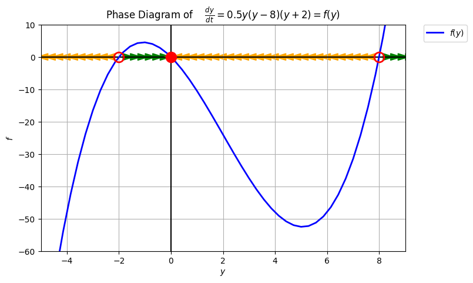
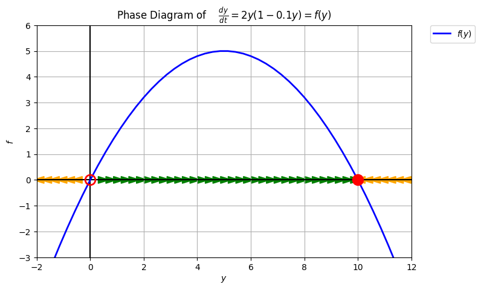
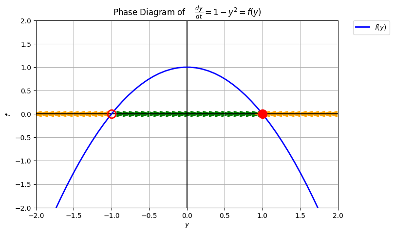
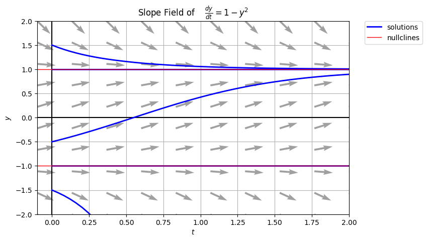
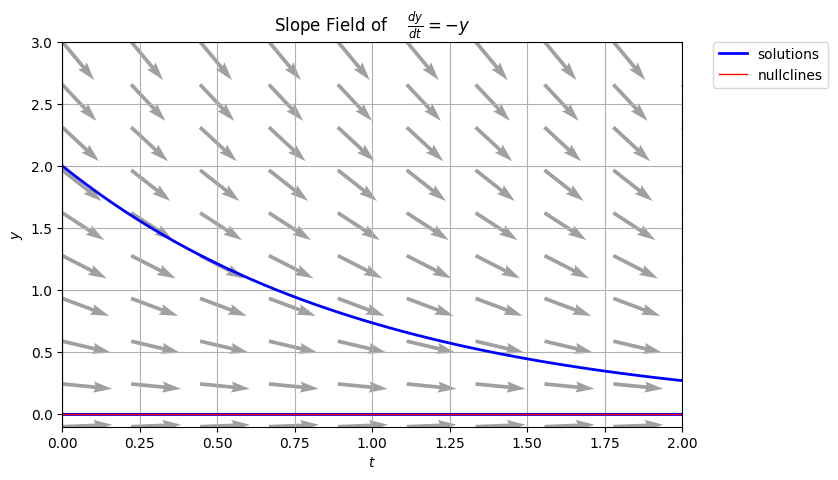
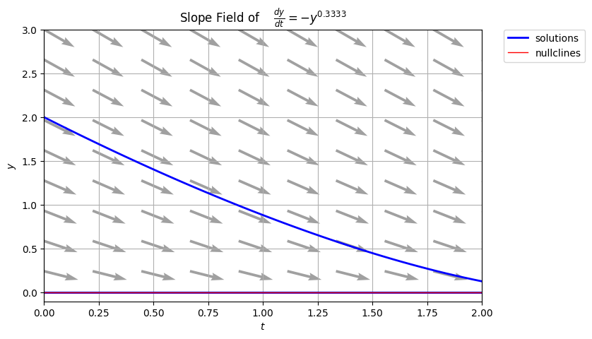
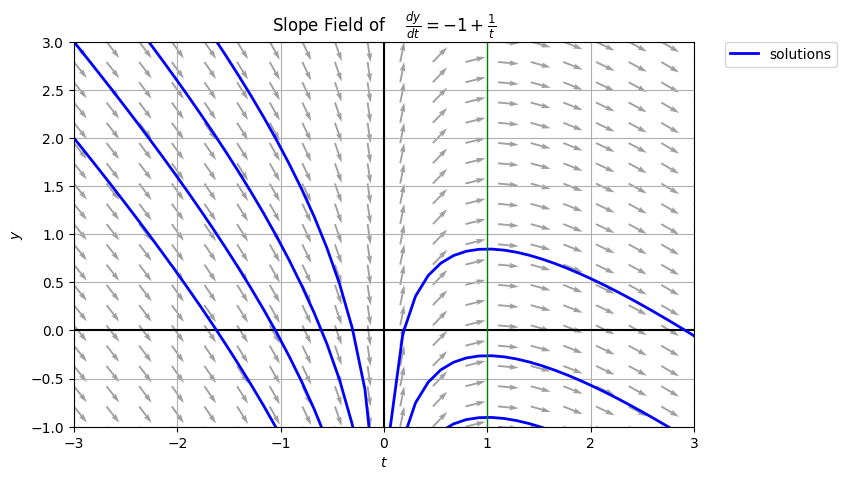
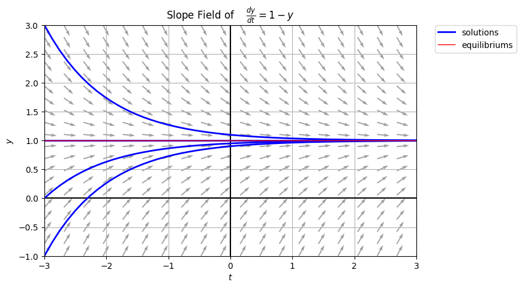
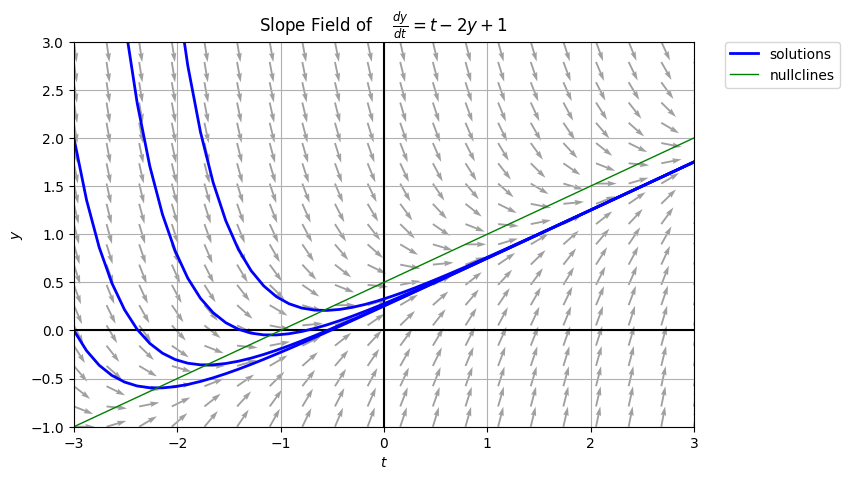
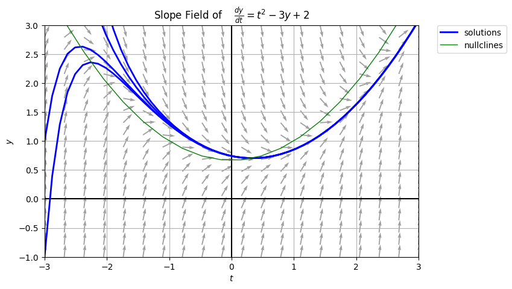

```{r setup, include=FALSE}
knitr::opts_chunk$set(echo = TRUE)
source(file.path("../../R/functions-mth321.R"))
```

**Instructions:** Homework is graded primarily on correctness and completion.

* Write your solutions on separate sheets of paper with your name written on each problem.
* Include all key steps and explanations that justify your answers, unless it says otherwise.
* Submit your written work as a `.pdf` file.
* Attach all supporting files as a `.zip` file if applicable.

\noindent\rule{\textwidth}{1pt}

## Homework Set 1

### 1. 

Consider the rate of change equation $$\displaystyle y'=\frac{y}{2}(2+y)(y-8),$$ which has been created to provide predictions about the future population of rabbits over time.

  \textcolor{blue}{
  Though not required, the solution to this problem is best illustrated by using a phase diagram shown below. Let $f(y) = 0.5y(2+y)(y-8).$
  }

```{r echo=FALSE, out.width = '60%', fig.align='center'}

```

\begin{tasks}
  \task For what values of $y$ is $y(t)$ increasing?
  
    \textcolor{blue}{$y(t)$ is increasing or $y' > 0$ if $-2 < y < 0$ and $y > 8$.}
    
  \task For what values of $y$ is $y(t)$ decreasing?
  
    \textcolor{blue}{$y(t)$ is decreasing or $y'< 0$ if $y < -2$ and $0 < y < 8$.}
    
  \task For what values of $y$ is $\displaystyle y'$ neither positive nor negative? What does this imply about the solution function $y(t)$?
  
    \textcolor{blue}{The critical points are when $y'=0$. So, $y'=0.5y(2+y)(y-8)$ if $y = 0$, $y = -2$, and $y=8$. The solution $y(t)$ is at the equilibrium or the solution neither increases nor decreases, it just stays the same for all $t$.}
    
\end{tasks}

### 2. 

Valeria created the following graph to help her analyze solutions to the ODE, $$\displaystyle y' = 2y \left(1-\frac{y}{10} \right).$$ What is this a graph of (i.e., what are the axes for this graph)? What information about solutions can you infer from this graph?

```{r echo=FALSE, out.width="80%", fig.align='center', fig.width=8, fig.height=3}
# define the function f(y)
f_y <- function(y) {
  return(2*y*(1-(y/10)))
}

# generate f(y) values
y_vec <- seq(-1,11,length.out=30)
df <- data.frame(x=y_vec,y=f_y(y_vec))

# plot f(y)
ggplot(df, aes(x=x, y=y)) + 
  geom_line(linewidth=1) +
  geom_hline(yintercept=0) +
  geom_vline(xintercept=0) +
  theme_minimal() + 
  theme(axis.title.x=element_blank(),
        axis.text.x=element_blank(),
        axis.ticks.x=element_blank(),
        axis.title.y=element_blank(),
        axis.text.y=element_blank(),
        axis.ticks.y=element_blank(),
        panel.grid.major = element_blank(),
        panel.grid.minor = element_blank())
```

  \textcolor{blue}{
  Valeria created a phase diagram that illustrates the behavior of solutions at a point in time. It shows the the region of increase and decrease of the solutions and the equilibriums. Let $f(y) = 2y \left(1-\frac{y}{10} \right)$. The completed diagram is shown below.
  }

```{r echo=FALSE, out.width = '60%', fig.align='center'}

```

### 3. 

For the ODE $\displaystyle y' = 1-y^2$,

\begin{tasks}
  \task Sketch a phase diagram by hand and explain why you can draw such visualization for the given ODE. 
  \task Sketch a slope field by hand and explain any shortcuts or patterns you used to  make the task easier.
  \task Sketch several specific solutions (including the equilibriums) on the slope field.
\end{tasks}

  \textcolor{blue}{
  a) and c)
  }

```{r echo=FALSE, out.width = '49%', fig.align='center', fig.show='hold'}


```

  \textcolor{blue}{
  b) \\
  Shortcuts on drawing the phase diagram include solving for the equilibrium solution (critical points) of the ODE and recognizing that the ODE $f(y) = 1-y^2$ is a concave down parabola shifted upward by one unit. \\
  Shortcuts on drawing the slope field include solving for the isocline and nullcline functions and used it as a guide on where the points have the same slope.
  }
  
### 4.

Suppose two students are memorizing the elements on a list according to the rate of change equation $$\displaystyle L'=\frac{1}{2}(1-L),$$ where $L$ represents the fraction of the list that is memorized at time $t$.

\begin{tasks}
  \task If one of the students knows one-third of the list at time $t = 0$ and the other student knows none of the list, which student is learning most rapidly at this instant? Why?
  
    \textcolor{blue}{
    We compute the rate of change for each student:
      \begin{itemize}
        \item For student 1, who knows one-third of the list $L=\frac{1}{3}$ at $t=0$: $\displaystyle \frac{dL}{dt} = 0.5\left(1-\frac{1}{3}\right) = \frac{1}{3}.$
        \item For student 2, who knows one-third of the list $L=0$ at $t=0$: $\displaystyle \frac{dL}{dt} = 0.5\left(1-0\right) = \frac{1}{2}.$
      \end{itemize}
    Comparing the rates of change at $t=0$, we see that Student 2 is learning more rapidly because their rate of change is $\frac{1}{2}$, whereas Student 1 has a rate of change of $\frac{1}{3}$.
    }
    
  \task What does the rate of change equation predict for someone who begins with the list completely memorized? Explain.
  
    \textcolor{blue}{
    If someone begins with the list completely memorized, it means $L = 1$ at $t=0$. That is $$\frac{dL}{dt} = 0.5\left(1-1\right) = 0.$$
    The equation predicts that if someone already knows the entire list, their rate of change at any time $t$ will be $0$, meaning they already memorized all elements in the list.
    }
  
  \task Suppose now that the list so long that no one can read it in a lifetime, like the decimal representation for $\pi$. In reality, no one can memorize all the digits to $\pi$, but what does the rate of change equation predict will happen for a person who starts out not knowing any of the digits? That is, according to the rate of change equation, if $L = 0$ at time $t = 0$, is there ever a value of $t$ for which $L = 1$? Explain.
  
    \textcolor{blue}{
    The equation predicts that for someone who starts with none of the list memorized ($L=0$), their rate of learning at any time $t$ will be constant and equal to $\frac{1}{2}$. However, the equation never predicts that $L$ will become exactly $1$ because the rate of change is always $0.5(1-L)$, and as $L$ approaches $1$, the rate of change slows down. In other words, they will approach but never reach complete memorization. In context of the example with the infinite list like the digits of $\pi$, the person will keep learning, but they will never fully memorize the entire list according to the given ODE.
    }
  
\end{tasks}

### 5. 

A group of scientists at the Federal Aviation Association has come up with the following two different rate of change equations to predict the height of a helicopter as it nears the ground: $$h'=-h \qquad \text{ and } \qquad h'=-h^{\frac{1}{3}}.$$ For both rate of change equations $h$ is in feet and $t$ is in minutes. The scientists, of course, want their models to predict that a helicopter actually lands, but do either or both of the proposed models predict this? 

\begin{tasks}
  \task Below shows the corresponding slope fields for the given ODEs. Sketch in qualitatively correct graphs of the solution functions with initial conditions $h(0) = 0$ and $h(0) = 2$. 
```{r echo=FALSE, fig.align='center', message=FALSE, warning=FALSE, out.width="100%", fig.width=10,fig.height=4}
ode <- function(t,y,parameters){
  with(as.list(c(parameters)),{
    dy <- a*y^b
    return(list(dy))
  })
}

p1 <- SlopeField(ode,params=c(a=-1,b=1),
                 tlim=c(0,2),ylim=c(0,3),res=10,
                 scale=0.50,radius=0.10,unit=FALSE,
                 col="black",xlab="t",ylab="h",title=latex2exp::TeX("$h' = -h$"))

p2 <- SlopeField(ode,params=c(a=-1,b=1/3),
                 tlim=c(0,2),ylim=c(0,3),res=10,
                 scale=0.50,radius=0.10,unit=FALSE,
                 col="black",xlab="t",ylab="h",title=latex2exp::TeX("$h' = -h^{\\frac{1}{3}}$"))

grid.arrange(p1,p2,ncol=2)
```

```{r echo=FALSE, out.width = '49%', fig.align='center', fig.show='hold'}


```

  \task For each differential equation, use the uniqueness theorem to show whether the graphs of each ODE will ever touch or cross the equilibrium. Interpret the results in context.
  
  \textcolor{blue}
  {
  We use the existence and uniqueness theorem to answer this question:
    \begin{itemize}
      \item For the ODE $\displaystyle h'=-h$: Let $f(h) = -h$. The continuous domain is on $t \in (-\infty,\infty)$ and $h \in (-\infty,\infty)$. The partial derivative $\displaystyle \frac{\partial f}{\partial h} = -1$ is continuous on $t \in (-\infty,\infty)$ and $h \in (-\infty,\infty)$. The continuous domain includes the initial conditions $\displaystyle h(0) = 0$ and $\displaystyle h(0) = 2$. Therefore, the solutions to the ODE exists and unique, meaning the solution curves will approach but will never touch each other. The helicopter will not land.
      \item For the ODE $\displaystyle h'=-h^{\frac{1}{3}}$: Let $f(h) = -h^{\frac{1}{3}}$. The continuous domain is on $t \in (-\infty,\infty)$ and $h \in [0,\infty)$. The partial derivative $\displaystyle \frac{\partial f}{\partial h} = -\frac{1}{h^{\frac{2}{3}}}$ is continuous on $t \in (-\infty,\infty)$ and $h \in (0,\infty)$ but discontinuous on $\displaystyle h = 0$. The continuous domain includes the initial condition $\displaystyle h(0) = 2$ but not $\displaystyle h(0) = 0$. Therefore, the solutions to the ODE exists but not unique, meaning the solution curves will approach and touch each other. The helicopter will land.
    \end{itemize}
  }
  
\end{tasks}

### 6. 

Consider the ODE with initial condition, $$y'+ty=e^{-\frac{1}{2}t^2}, \hspace{20px} y(0)=1.$$ Show that $\displaystyle y(t)=te^{-\frac{1}{2}t^2}+e^{-\frac{1}{2}t^2}$ is a solution and explain why this is a specific solution.

  \textcolor{blue}{
  Compute the derivatives:
  $$
  \begin{aligned}
  y & = te^{-\frac{1}{2}t^2}+e^{-\frac{1}{2}t^2} \\
  y' & = -t^2 e^{-\frac{1}{2}t^2} - te^{-\frac{1}{2}t^2} + e^{-\frac{1}{2}t^2}
  \end{aligned}
  $$
  Substitute into the ODE:
  $$
  \begin{aligned}
  y' + ty & = e^{-\frac{1}{2}t^2} \\
  -t^2 e^{-\frac{1}{2}t^2} - te^{-\frac{1}{2}t^2} + e^{-\frac{1}{2}t^2} + t\left( te^{-\frac{1}{2}t^2}+e^{-\frac{1}{2}t^2} \right) & = e^{-\frac{1}{2}t^2} \\
  -t^2 e^{-\frac{1}{2}t^2} - te^{-\frac{1}{2}t^2} + e^{-\frac{1}{2}t^2} + t^2 e^{-\frac{1}{2}t^2} + te^{-\frac{1}{2}t^2} & = e^{-\frac{1}{2}t^2} \\
  e^{-\frac{1}{2}t^2} & = e^{-\frac{1}{2}t^2} \\
  1 & = 1
  \end{aligned}
  $$
  Therefore, $y(t)=te^{-\frac{1}{2}t^2}+e^{-\frac{1}{2}t^2}$ is a solution. It is a specific solution because the arbitrary constant is already solved using the initial condition $y(0) = 1$, which is also consistent with the solution:
  $$y(0)=0e^{-\frac{1}{2}0^2}+e^{-\frac{1}{2}0^2} = 1.$$
  }

### 7. 

For each ODE, 

* determine all equilibrium solutions if any, and
* use the existence and uniqueness theorem to determine whether or not graphs of solution functions will ever touch any and all equilibrium solutions.

\begin{tasks}(4)
  \task $\displaystyle L'=.5(1-L)$
  \task $\displaystyle y'=0.3y\left(1-\frac{y}{10}\right)$
  \task $\displaystyle y'=-t+1$
  \task $\displaystyle y'=y^{\frac{1}{2}}$
\end{tasks}

  \textcolor{blue}{
    \begin{tasks}
      \task The equilibrium solution to $\displaystyle L'=.5(1-L)$ is $\displaystyle L(t) = 1$ because the critical points to $\displaystyle 0=.5(1-L)$ is $L=1$. The ODE is continuous on the domain $t \in (-\infty,\infty)$ and $L \in (-\infty,\infty)$. Let $\displaystyle f(L) = .5(1-L)$. The partial derivative $\displaystyle \frac{\partial f}{\partial L} = .5$ is continuous on $t \in (-\infty,\infty)$ and $L \in (-\infty,\infty)$. The continuous domain includes the initial condition of the equilibrium $L(0) = 1$. Therefore, the solutions exists and unique. The solution functions will never touch the equilibrium.
      \task The equilibrium solutions to $\displaystyle y'=0.3y\left(1-\frac{y}{10}\right)$ are $y(t) = 0$ and $y(t) = 10$ because the critical points to $\displaystyle 0=0.3y\left(1-\frac{y}{10}\right)$ are $y=0$ and $y=10$. The ODE is continuous on the domain $t \in (-\infty,\infty)$ and $y \in (-\infty,\infty)$. Let $\displaystyle f(y) = 0.3y\left(1-\frac{y}{10}\right)$. The partial derivative $\displaystyle \frac{\partial f}{\partial y} = 0.3 - 0.06y$ is continuous on $t \in (-\infty,\infty)$ and $y \in (-\infty,\infty)$. The continuous domain includes the initial condition of the equilibriums $y(0) = 0$ and $y(0)=10$. Therefore, the solutions exists and unique. The solution functions will never touch the equilibrium.
      \task There are no equilibrium solutions since $\displaystyle y'=-t+1$ is a non-autonomous ODE. However, the ODE is continuous on the domain $t \in (-\infty,\infty)$ and $y \in (-\infty,\infty)$.
      \task The equilibrium solution to $\displaystyle y'=y^{\frac{1}{2}}$ is $\displaystyle y(t) = 0$ because the critical points to $\displaystyle 0=y^{\frac{1}{2}}$ is $y=0$. The ODE is continuous on the domain $t \in (-\infty,\infty)$ and $y \in (-\infty,\infty)$. Let $\displaystyle f(y) = y^{\frac{1}{2}}$. The partial derivative $\displaystyle \frac{\partial f}{\partial L} = \frac{1}{2}y^{-\frac{1}{2}}$ is continuous on $t \in (-\infty,\infty)$ and $y \in (0,\infty)$ but discontinuous on $y=0$. The continuous domain does not include the initial condition of the equilibrium $y(0)=0$. Therefore, the solutions exist but not unique. The solution functions will touch the equilibrium.
    \end{tasks}
  }

### 8. 

The following questions relates to the general definition of ODEs and their solutions. Answer each question with at least two to three sentences.

\begin{tasks}
  \task In algebra, the goal of solving an equation such as $x^2 + 4x =2$ is to find the values of $x$ that make a true statement. In differential equations, what is the goal of solving an equation such as $\displaystyle x'+4x=2$? Explain your reasoning.
  
    \textcolor{blue}{
    In ODEs, the goal of solving an equation such as $\displaystyle x' + 4x = 2$ is to find a function or a family of functions that satisfy the equation. Specifically, we are looking for the function $x(t)$ that makes the equation true for all values of $t$ within a certain domain. Unlike algebraic equation where we are solving for specific values (e.g., solving for $x$ in $x^2 + 4x =2$), solving an ODE involves finding a function that describes the relationship between a dependent variable and one or more independent variables based on the given equation.
    }
  
  \task The letter $y$ appears in two places in the differential equation $\displaystyle y' = 0.3y.$ Is it appropriate to think of both occurrences of $y$ as function of $t$? Explain your reasoning.
  
    \textcolor{blue}{
    Yes, it is appropriate to think of both occurrences of $y$ as a function of $t$ in the ODE $\displaystyle y' = 0.3y.$ The left-hand side of the ODE $y'$ represents the rate of change of the function $y$ with respect to $t$. This is common in differential calculus, where it tells you how the function $y$ changes as $t$ changes. The right-hand side of the ODE $0.3y$ is a multiple of function $y$ where $0.3$ is a constant coefficient. This implies that the rate of change of $y$ is proportional to the value of $y$ itself. This is a characteristic of exponential growth, where the rate of change is proportional to the current value. So, both occurrences of $y$ in the ODE $\displaystyle y' = 0.3y$ refer to the same function $y(t)$, which represents represents the relationship of the its derivative $y'$ and itself $y(t)$. This equation is a simple example of a 1st-order linear ODE, where the rate of change is directly proportional to its current value.
    }
    
  \task What are the key differences between general and specific solutions of an ODE? Explain your reasoning.
  
  \textcolor{blue}{
  General solutions are exact solutions with constants of integration while specific solutions are exact solutions where the constants of integration are solved using a condition.
  }
  
  \task An equilibrium solution is a constant solution where the rate of change is zero in the long term. Is it true that equilibrium solutions are nullclines but not all nullclines are equilibriums? Explain your reasoning.
  
  \textcolor{blue}{
  Yes. Nullclines are defined where the rate of change is zero (critical points) while equilibriums are defined as critical points and those critical points has to be a constant solution to the ODE. So, equilibriums are critical points which happens to be also nullclines for autonomous ODEs, but nullclines are critical points only for autonomous and non-autonomous ODEs with no equilibriums.
  }
    
\end{tasks}

### 9.

Construct one ODE for each of the following classifications. For each case, briefly explain why the equation satisfies the specified criteria or justify why such an equation cannot exist.

\begin{tasks}
  \task 1st-order, homogeneous, non-autonomous, linear
  
    \textcolor{blue}{
    $$y' + t^2 y = 0$$
      \begin{itemize}
        \item The ODE is 1st-order because the highest derivative of the dependent variable in the equation is the 1st derivative.
        \item It is homogeneous because, when rewriting the ODE to make all terms of $y$ and its derivatives to the left-hand side and the rest to the right-hand side, the right-hand side is $0$.
        \item It is non-autonomous because $t$ is explicitly written in the equation; the term $t^2 y$.
        \item It is linear because the dependent variable and its derivative is not multiplied to each other nor as a function of a non-linear term.
      \end{itemize}
    }
  
  \task 1st-order, non-homogeneous, autonomous, non-linear
  
    \textcolor{blue}{
    $$y' - y^2 = 1$$
      \begin{itemize}
        \item The ODE is 1st-order because the highest derivative of the dependent variable in the equation is the 1st derivative.
        \item It is non-homogeneous because, when rewriting the ODE to make all terms of $y$ and its derivatives to the left-hand side and the rest to the right-hand side, the right-hand side is non-zero; the value is $1$.
        \item It is autonomous because $t$ is not explicitly written in the equation.
        \item It is non-linear because the dependent variable and its derivative is as a function of a non-linear term; the term $-y^2$.
      \end{itemize}
    }
  
  \task 1st-order, non-homogeneous, non-autonomous, linear
  
    \textcolor{blue}{
    $$y' + t^2 y = \frac{1}{t}$$
      \begin{itemize}
        \item The ODE is 1st-order because the highest derivative of the dependent variable in the equation is the 1st derivative.
        \item It is non-homogeneous because, when rewriting the ODE to make all terms of $y$ and its derivatives to the left-hand side and the rest to the right-hand side, the right-hand side is non-zero; the value is a function $\frac{1}{t}$.
        \item It is non-autonomous because $t$ is explicitly written in the equation.
        \item It is linear because the dependent variable and its derivative are written as a linear combination where the coefficients are either constants or a function of $t$.
      \end{itemize}
    }
  
  \task 2nd-order, homogeneous, non-autonomous, linear
  
    \textcolor{blue}{
    $$y'' + t^2 y = 0$$
      \begin{itemize}
        \item The ODE is 2nd-order because the highest derivative of the dependent variable in the equation is the 2nd derivative.
        \item It is homogeneous because, when rewriting the ODE to make all terms of $y$ and its derivatives to the left-hand side and the rest to the right-hand side, the right-hand side is $0$.
        \item It is non-autonomous because $t$ is explicitly written in the equation; the term $t^2$.
        \item It is linear because the dependent variable and its derivative is not multiplied to each other nor as a function of a non-linear term.
      \end{itemize}
    }
  
  \task 2nd-order, non-homogeneous, autonomous, non-linear
  
    \textcolor{blue}{
    $$y'' + y^2 = 1$$
      \begin{itemize}
        \item The ODE is 2nd-order because the highest derivative of the dependent variable in the equation is the 2nd derivative.
        \item It is non-homogeneous because, when rewriting the ODE to make all terms of $y$ and its derivatives to the left-hand side and the rest to the right-hand side, the right-hand side is non-zero; the value is $1$.
        \item It is autonomous because $t$ is not explicitly written in the equation.
        \item It is non-linear because the dependent variable and its derivative is as a function of a non-linear term; the term $-y^2$.
      \end{itemize}
    }
    
  \task 2nd-order, non-homogeneous, non-autonomous, linear
    
    \textcolor{blue}{
    $$y'' - y' + 3y = t^2$$
      \begin{itemize}
        \item The ODE is 2nd-order because the highest derivative of the dependent variable in the equation is the 2nd derivative.
        \item It is non-homogeneous because, when rewriting the ODE to make all terms of $y$ and its derivatives to the left-hand side and the rest to the right-hand side, the right-hand side is a function $t^2$.
        \item It is non-autonomous because $t$ is explicitly written in the equation.
        \item It is linear because the dependent variable and its derivative are written as a linear combination where the coefficients are either constants or a function of $t$.
      \end{itemize}
    }
    
\end{tasks}

### 10. Challenge Problem

Consider the 1st-order ODE,

$$y' = n(1-y) - (1-t^{n-1})$$

where $n$ is a positive integer, $n \ge 0$.

\begin{tasks}
  \task Classify the given differential equation in terms of order, autonomy, homogeniety, and linearity for cases when $n=0$, $n=1$, and $n > 1$.
  
    \textcolor{blue}{
      \begin{itemize}
        \item $n=0$: $\displaystyle y' = -(1-t^{-1})$
          \begin{itemize}
              \item 1st-order, because the highest derivative is 1st-order
              \item non-autonomous, because the independent variable $t$ is explicitly written
              \item non-homogeneous, the right-hand side after rewriting is non-zero
              \item linear, the dependent variable $y$ and its derivatives are not written as a non-linear term
          \end{itemize}
        \item $n=1$: $\displaystyle y' = 1-y$
          \begin{itemize}
              \item 1st-order, because the highest derivative is 1st-order
              \item autonomous, because the independent variable $t$ is not explicitly written
              \item non-homogeneous, the right-hand side after rewriting is non-zero
              \item linear, the dependent variable $y$ and its derivatives are not written as a non-linear term
          \end{itemize}
        \item $n>1$: $\displaystyle y' = n(1-y) - (1-t^{n-1})$
          \begin{itemize}
              \item 1st-order, because the highest derivative is 1st-order
              \item non-autonomous, because the independent variable $t$ is explicitly written
              \item non-homogeneous, the right-hand side after rewriting is non-zero
              \item linear, the dependent variable $y$ and its derivatives are not written as a non-linear term
          \end{itemize}
      \end{itemize}
    }
  
  \task Determine the values of $n$ where there are equilibrium solutions and values of $n$ where there are none.
  
    \textcolor{blue}{
    There are no equilibriums solutions for the non-autonomous cases. That is when $n \ne 1$. If $n=1$, then the ODE is autonomous with equilibrium solution of $y(t) = 1$ because the critical point of $\displaystyle 0 = 1-y$ is $y=1$.
    }
  
  \task Create a function for the isoclines and nullclines for each case of $n$, and draw these functions on your slope fields.
  
    \textcolor{blue}{
      \begin{itemize}
        \item $n=0$: $\displaystyle y' = -(1-t^{-1})$
          $$
          \begin{aligned}
          c   & = -(1-t^{-1}) \\
          c+1 & = \frac{1}{t} \\
          t   & = \frac{1}{c+1}
          \end{aligned}
          $$
          The isoclines are just vertical lines defined by $\displaystyle t = \frac{1}{c+1}$ for some value $\displaystyle c = y'$. If $c=0$, then the nullcline is $\displaystyle t = 1$.
        \item $n=1$: $\displaystyle y' = 1-y$
          $$
          \begin{aligned}
          c   & = 1-y \\
          y & = 1-c
          \end{aligned}
          $$
          The isoclines are just horizontal lines defined by $\displaystyle y = 1-c$ for some value $\displaystyle c = y'$. If $c=0$, then the nullcline is $\displaystyle y = 0$.
        \item $n>1$: $\displaystyle y' = n(1-y) - (1-t^{n-1})$
          $$
          \begin{aligned}
          c   & = n(1-y) - (1-t^{n-1}) \\
          c + (1-t^{n-1}) & = n(1-y) \\
          c + (1-t^{n-1}) - n & = -ny \\
          y & = - \frac{1}{n} \left( c + (1-t^{n-1}) - n \right) \\
          y & = 1 - \frac{1}{n} \left( c + (1-t^{n-1}) \right)
          \end{aligned}
          $$
          The isoclines are curves defined by a function of $t$, $\displaystyle y(t) = 1 - \frac{1}{n} \left( c + (1-t^{n-1}) \right)$ for some value $\displaystyle c = y'$. If $c=0$, then the nullcline is $\displaystyle y(t) = 1 - \frac{1}{n} + \frac{t^{n-1}}{n}$.
      \end{itemize}
    }
  
  \task Draw slope fields for cases when $n=0$, $n=1$, and $n > 1$ (for even and odd numbers, give one example each), and then draw at least four qualitatively different solution curves (including equilibriums if any).
  
```{r echo=FALSE, out.width = '49%', fig.align='center', fig.show='hold'}


```

```{r echo=FALSE, out.width = '49%', fig.align='center', fig.show='hold'}


```
  
\end{tasks}

<!-- \newpage

## **References**

::: {#refs}
:::

<br> -->
