```{r setup, include=FALSE}
knitr::opts_chunk$set(echo = TRUE)
source(file.path("../../R/functions-mth321.R"))
```

**Instructions:** Homework is graded primarily on correctness and completion.

* Write your solutions on separate sheets of paper with your name written on each problem.
* Include all key steps and explanations that justify your answers, unless it says otherwise.
* Submit your written work as a `.pdf` file.
* Attach all supporting files as a `.zip` file if applicable.

\noindent\rule{\textwidth}{1pt}

## Homework Set 2

### 1. 

For each of the following autonomous ODE:

* illustrate with suitable phase diagrams the way in which the solutions and equilibriums change as the value of $r$ changes, and
* identify the precise value(s) of $r$ for which there is a either a change in the number of equilibrium solution(s) or a change in the type of equilibrium solution(s).

\begin{tasks}
  \task $\displaystyle y'=(y-3)^2+r$
  
  \textcolor{blue}{
  $$
  \begin{aligned}
  y' & = (y-3)^2+r \\
  0 & = (y-3)^2+r \\
  y & = 3 \pm \sqrt{-r}
  \end{aligned}
  $$
  So, the equilibrium solutions are the following:
  \begin{itemize}
    \item If $r < 0$, then there are two equilibrium solutions $y_1 = 3 - \sqrt{-r}$ (stable) and $y_2 = 3 + \sqrt{-r}$ (unstable).
    \item If $r = 0$, then there is only one equilibrium solution $y = 3$ (semi-stable).
    \item If $r > 0$, then there are no equilibrium solutions.
  \end{itemize}
  The bifurcation is the change in the number of equilibriums and the bifurcation point is at $r=0$.
  }
  
  \task $\displaystyle y'=y^2-ry+1$
  
  \textcolor{blue}{
  $$
  \begin{aligned}
  y' & = y^2-ry+1 \\
  0 & = y^2-ry+1 \\
  y & = \frac{r}{2} \pm \frac{\sqrt{r^2 - 4}}{2}
  \end{aligned}
  $$
  So, the equilibrium solutions are the following:
  \begin{itemize}
    \item If $-2 < r < 2$, then there are no equilibrium solutions.
    \item If $r = \pm2$, then there is only on equilibrium solution $y = \frac{r}{2}$ (semi-stable).
    \item If $r< -2$ and $r > 2$, then are two equilibrium solutions $y_1 = \frac{r}{2} - \frac{\sqrt{r^2 - 4}}{2}$ (stable) and $y_2 =  \frac{r}{2} + \frac{\sqrt{r^2 - 4}}{2}$ (unstable).
  \end{itemize}
  The bifurcation is the change in the number of equilibriums and the bifurcation points are at $r = \pm 2$.
  }
  
  \task $\displaystyle y'=ry+y^3$

  \textcolor{blue}{
  $$
  \begin{aligned}
  y' & = ry+y^3 \\
  0 & = ry+y^3 \\
  y & = \pm \sqrt{-r} \hspace{10px} \text{ and } \hspace{10px} y = 0
  \end{aligned}
  $$
  So, the equilibrium solutions are the following:
  \begin{itemize}
    \item If $r < 0$, then are three equilibriums $y_1 = - \sqrt{-r}$ (unstable), $y_2 = 0$ (stable), and $y_3 = \sqrt{-r}$ (unstable).
    \item If $r \ge 0$, then there is only one equilibrium $y = 0$ (unstable).
  \end{itemize}
  }
\end{tasks}

\newpage

  \textcolor{blue}{Phase Diagrams:}
  \begin{itemize}
    \item \textcolor{blue}{$\displaystyle y'=(y-3)^2+r$}
```{r echo=FALSE, out.width = '32%', fig.align='center', fig.show='hold'}
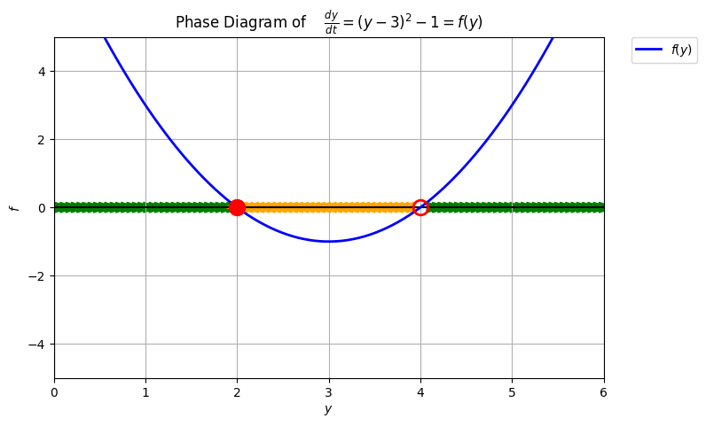
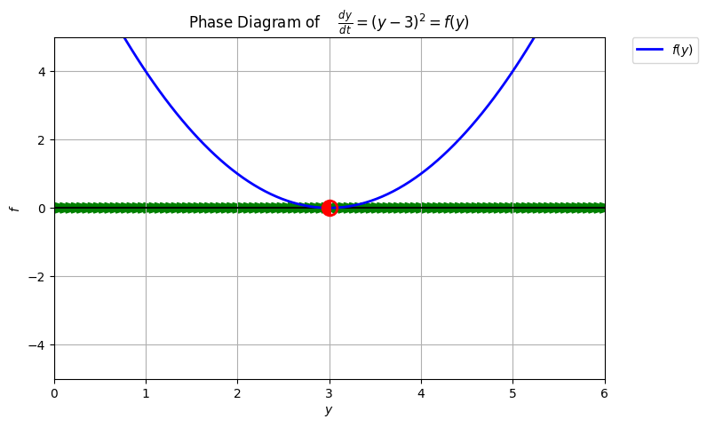
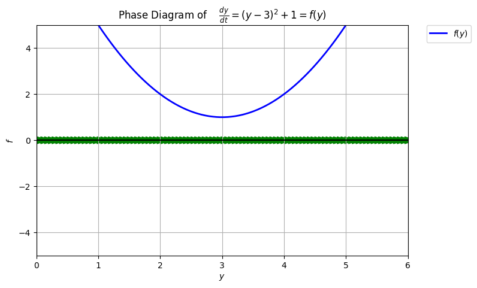
```
    \item \textcolor{blue}{$\displaystyle y'=y^2-ry+1$}
```{r echo=FALSE, out.width = '32%', fig.align='center', fig.show='hold'}
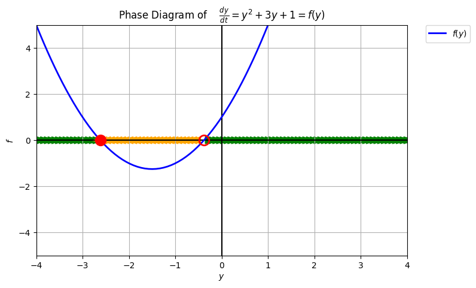
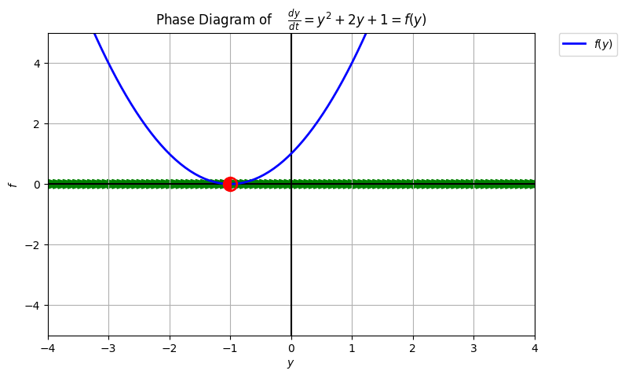
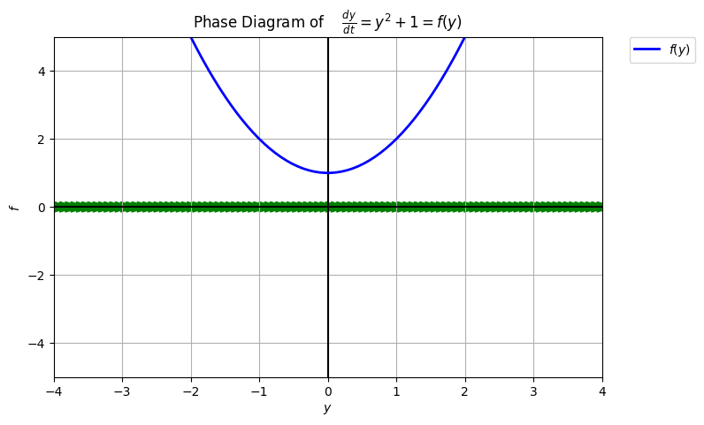
```
```{r echo=FALSE, out.width = '49%', fig.align='center', fig.show='hold'}
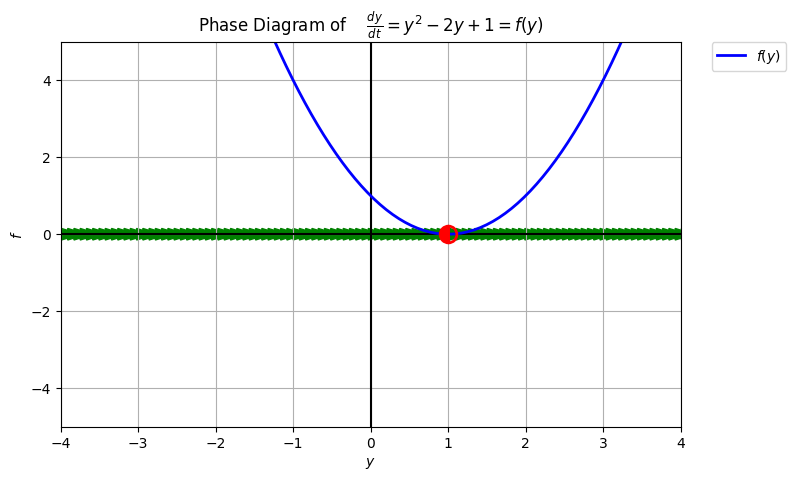
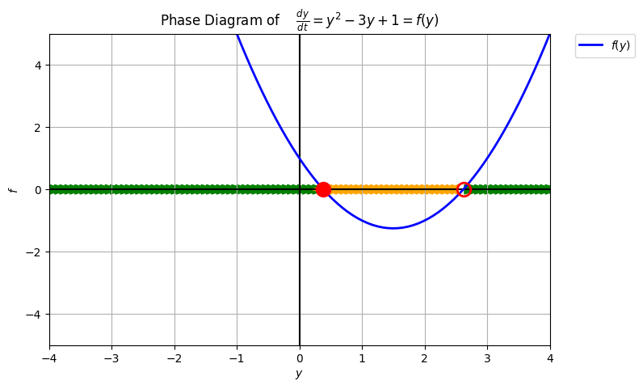
```
    \item \textcolor{blue}{$\displaystyle y'=ry+y^3$}
```{r echo=FALSE, out.width = '49%', fig.align='center', fig.show='hold'}
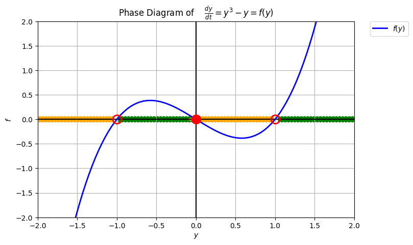
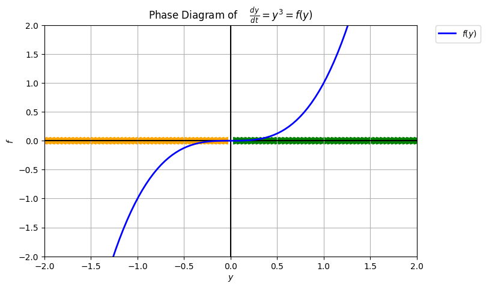
```
  \end{itemize}

### 2. 

For each of the following ODE, determine which method(s) --separation of variables (SOV) or integrating factors (IF)-- could be used to find the general solution, and draw a slope field with at least three qualitatively different solution curves. Explain why such method(s) can be used. Do not find the general solution.

\begin{tasks}(3)
  \task $\displaystyle y'=2y-3e^{-t}$
  
  \textcolor{blue}{
  The 1st-order linear form is $\displaystyle y'-2y=-3e^{-t}$. So, linear but not separable; IF.
  }
  
  \task $\displaystyle y'=-0.2(75-y)$
  
  \textcolor{blue}{
  It is already in separable form and it can be written in 1st-order linear form, $\displaystyle y' - 0.2y = -0.2(75)$. So, linear and separable; SOV and IF
  }
  
  \task $\displaystyle y'=y^2+1$
  
  \textcolor{blue}{
  It is already in separable form. So, non-linear but separable; SOV
  }
  
  \task $\displaystyle y'=e^t y-\cos{(t)}$
  
  \textcolor{blue}{
  The 1st-order linear form is $\displaystyle y' + e^t y = -\cos{(t)}$. So, linear but not separable; IF
  }
  
  \task $\displaystyle t^2 y y' = (y^2 - 1)^{3/2}$
  
  \textcolor{blue}{
  The ODE can be written in separable form, $\displaystyle y' = \left(\frac{(y^2 - 1)^{3/2}}{y}\right)\left(\frac{1}{t^2}\right)$. So, non-linear but separable; SOV
  }
  
  \task $\displaystyle y' - \frac{2}{t} y = t^2$
  
  \textcolor{blue}{
  The ODE is already in 1st-order linear form. So, linear but not separable; IF
  }
  
\end{tasks}

  \textcolor{blue}{Slope Fields:}
  \begin{itemize}
    \item \textcolor{blue}{$\displaystyle y'=2y-3e^{-t}$}
```{r echo=FALSE, out.width = '60%', fig.align='center', fig.show='hold'}
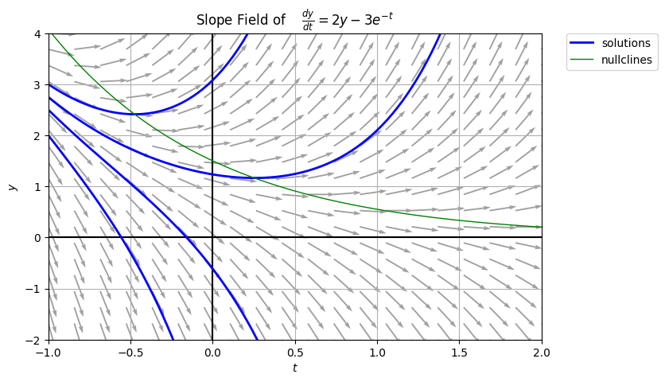
```
    \item \textcolor{blue}{$\displaystyle y'=-0.2(75-y)$}
```{r echo=FALSE, out.width = '60%', fig.align='center', fig.show='hold'}
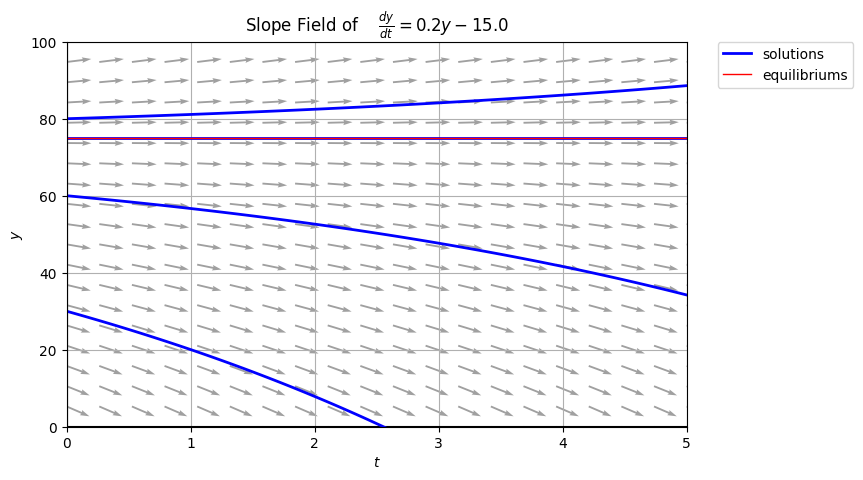
```
    \item \textcolor{blue}{$\displaystyle y'=y^2+1$}
```{r echo=FALSE, out.width = '60%', fig.align='center', fig.show='hold'}
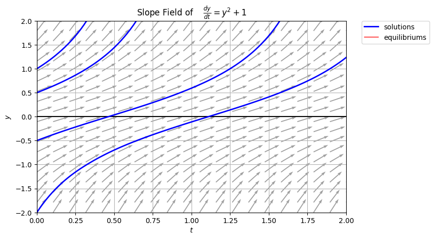
```
    \item \textcolor{blue}{$\displaystyle y'=e^t y-\cos{(t)}$}
```{r echo=FALSE, out.width = '60%', fig.align='center', fig.show='hold'}
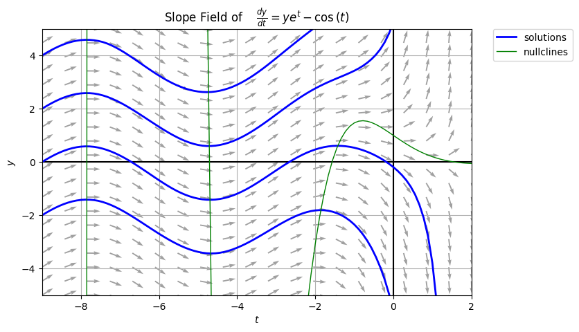
```
    \item \textcolor{blue}{$\displaystyle t^2 y y' = \sqrt{1 - y^2}$ \\ TBW}
    \item \textcolor{blue}{$\displaystyle y' - \frac{2}{t} y = t^2$}
```{r echo=FALSE, out.width = '60%', fig.align='center', fig.show='hold'}
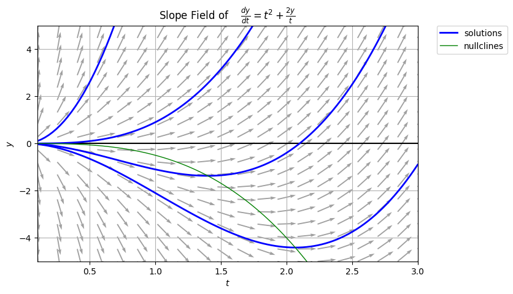
```
  \end{itemize}

### 3. 

Solve the following initial value problem in two ways: once using separation of variables, and once using integrating factors. $$y' = 2y+1\, ; \quad y(0)=2.$$

  \textcolor{blue}{
  Finding the general solution using:
    \begin{itemize}
      \item Separation of Variables
        $$
        \begin{aligned}
        y' & = 2y+1 \\
        \frac{dy}{2y + 1} & = dt \\
        \int \frac{dy}{2y + 1} & = \int dt \\
        \frac{1}{2} \ln{\left(2y+1\right)} & = t + C \\
        \ln{\left((2y+1)^{\frac{1}{2}}\right)} & = t + C \\
        (2y+1)^{\frac{1}{2}} & = e^{t + C} \\
        y & = A e^{2t} - \frac{1}{2} \longleftarrow \text{general solution}
        \end{aligned}
        $$
      \item Integrating Factors
        $$
        \begin{aligned}
        y' - 2y & = 1 \\
        uy' - 2uy & = u
        \end{aligned}
        $$
        $$
        \begin{aligned}
        u' & = -2u \\
        \frac{du}{u} & = -2 dt \\
        \int \frac{du}{u} & = \int -2 dt \\
        \ln{(u)} & = -2t \\
        u & = e^{-2t}
        \end{aligned}
        $$
        $$
        \begin{aligned}
        uy' - 2uy & = u \\
        e^{-2t}y' - 2e^{-2t} y & = e^{-2t} \\
        \left[ e^{2t} y\right]' & = e^{2t} \\
        \int \left[ e^{-2t} y \right]' & = \int e^{-2t} \ dt \\
        e^{-2t} y & = -\frac{e^{-2t}}{2} + A \\
        y & = -\frac{1}{2} + Ae^{2t} \longleftarrow \text{general solution}
        \end{aligned}
        $$
    \end{itemize}
    Using the initial condition $y(0) = 2$,
    $$
    \begin{aligned}
    y(0) & = Ae^{2(0)} - \frac{1}{2} \\
    2 & = A - \frac{1}{2} \\
    A & = \frac{5}{2} \\
    y & = \frac{5}{2} e^{2t} - \frac{1}{2} \longleftarrow \text{specific solution}
    \end{aligned}
    $$
  }

### 4. 

Find the general solution to the following differential equations using separation of variables or integrating factors. Give a reason as to why you used the method you chose over the other.

\begin{tasks}
  \task $\displaystyle y'-2y+t=0$
  
  \textcolor{blue}{
  The ODE is linear but not separable. So, IF.
  $$
  \begin{aligned}
  y' - 2y & = -t \\
  uy' - 2uy & = -ut
  \end{aligned}
  $$
  $$
  \begin{aligned}
  u' & = -2u \\
  \frac{du}{u} & = -2dt \\
  \int \frac{du}{u} & = \int -2dt \\
  \ln{(u)} & = -2t \\
  u = e^{-2t}
  \end{aligned}
  $$
  $$
  \begin{aligned}
  e^{-2t}y' - 2e^{-2t}y & = -e^{-2t}t \\
  \left[ e^{-2t} y\right]' & = -e^{-2t}t \\
  \int \left[ e^{-2t} y\right]' & = \int -e^{-2t}t \ dt \\
  e^{-2t} y & = \frac{2t+1}{4} e^{-2t} + C \\
  y & = \frac{2t+1}{4} + C e^{2t} \longleftarrow \text{general solution}
  \end{aligned}
  $$
  }
  
  \task $\displaystyle y'=-\frac{y}{t}+2$
  
  \textcolor{blue}{
  The ODE is linear but not separable. So, IF.
  $$
  \begin{aligned}
  y'+\frac{1}{t} y & = 2 \\
  uy'+\frac{u}{t} y & = 2u
  \end{aligned}
  $$
  $$
  \begin{aligned}
  u' & = \frac{u}{t} \\
  \frac{du}{u} & = \frac{dt}{t} \\
  \int \frac{du}{u} & = \int \frac{dt}{t} \\
  \ln{(u)} & = \ln{(t)} \\
  u & = t
  \end{aligned}
  $$
  $$
  \begin{aligned}
  uy'+\frac{u}{t} y & = 2u \\
  ty'+ y & = 2t \\
  \left[ ty \right]' & = 2t \\
  \int \left[ ty \right]' & = \int 2t \ dt \\
  ty & = t^2 + C \\
  y & = t + \frac{C}{t} \longleftarrow \text{general solution}
  \end{aligned}
  $$
  }
  
  \task $\displaystyle y'=y\sin{(t)}$
  
  \textcolor{blue}{
  The ODE is linear and separable. So, IF or SOV.
  $$
  \begin{aligned}
  \frac{dy}{y} & = \sin{(t)} \ dt \\
  \int \frac{dy}{y} & = \int \sin{(t)} \ dt \\
  \ln{(y)} & = -\cos{(t)} + C \\
  y & = Ae^{-\cos{(t)}} \longleftarrow \text{general solution}
  \end{aligned}
  $$
  }
  
  \task $\displaystyle y'-\cos{(t)}=0$
  
  \textcolor{blue}{
  The ODE can be solve through direct integration.
  $$
  \begin{aligned}
  y' & = \cos{(t)} \\
  \int y' & = \int \cos{(t)} \ dt \\
  y & = \sin{(t)} + C \longleftarrow \text{general solution}
  \end{aligned}
  $$
  }
  
  \task $\displaystyle y' = 2(y-1)$
  
  \textcolor{blue}{
  The ODE is linear and separable. So, IF or SOV.
  $$
  \begin{aligned}
  \frac{dy}{y-1} & = 2 \ dt \\
  \int \frac{dy}{y-1} & = \int 2 \ dt \\
  \ln{(y-1)} & = 2t + C \\
  y - 1 & = Ae^{2t} \\
  y & = 1 + Ae^{2t} \longleftarrow \text{general solution}
  \end{aligned}
  $$
  }
  
  \task $\displaystyle y' + 3y = 6t$
  
  \textcolor{blue}{
  The ODE is linear but not separable. So, IF.
  $$
  \begin{aligned}
  y' + 3y & = 6t \\
  uy' + 3uy & = 6tu
  \end{aligned}
  $$
  $$
  \begin{aligned}
  u' & = 3u \\
  \frac{du}{u} & = 3 \ dt \\
  \int \frac{du}{u} & = \int 3 \ dt \\
  \ln{(u)} & = 3t \\
  u & = e^{3t}
  \end{aligned}
  $$
  $$
  \begin{aligned}
  \begin{aligned}
  uy' + 3uy & = 6tu \\
  e^{3t}y' + 3e^{3t}y & = 6te^{3t} \\
  \left[ e^{3t} y \right]' & = 6te^{3t} \\
  \int \left[ e^{3t} y \right]' & = \int 6te^{3t} \ dt  \\
  e^{3t} y & = \frac{(6t - 2)}{3} e^{3t} + C \\
  y & = \frac{(6t - 2)}{3} + C e^{3t} \longleftarrow \text{general solution}
  \end{aligned}
  \end{aligned}
  $$
  }
  
\end{tasks}

### 5. 

Find the specific solution to the following initial value problems.

\begin{tasks}
  \task $\displaystyle y'=\frac{-t}{y}; \hspace{10px} y(0)=4$
  
  \textcolor{blue}{
  $$
  \begin{aligned}
  y' & = \frac{-t}{y} \\
  y \ dy & = -t \ dt \\
  \int y \ dy & = \int -t \ dt \\
  \frac{y^2}{2} & = -\frac{t^2}{2} + C \\
  y^2 & = -t^2 + A \\
  y & = \pm \sqrt{A - t^2} \longleftarrow \text{general solution}
  \end{aligned}
  $$
  Using the initial condition $y(0) = 4$:
  $$
  \begin{aligned}
  y(0) & = \pm \sqrt{A - 0^2} \\
  4 & = \pm \sqrt{A} \\
  A & = 16 \\
  y & = \pm \sqrt{16 - t^2} \longleftarrow \text{specific solution}
  \end{aligned}
  $$
  }
  
  \task $\displaystyle y'=-\sqrt[3]{y}; \hspace{10px} y(0)=27$
  
  \textcolor{blue}{
  $$
  \begin{aligned}
  y' & = -\sqrt[3]{y} \\
  \frac{dy}{-\sqrt[3]{y}} & = - \ dt \\
  \int \frac{dy}{\sqrt[3]{y}} & = \int - \ dt \\
  \frac{3}{4} y^{\frac{4}{3}} & = -t + C \\
  y^{\frac{4}{3}} & = - \frac{4}{3} t + A \\
  y & = \left(A - \frac{4}{3} t \right)^{\frac{3}{4}} \longleftarrow \text{general solution}
  \end{aligned}
  $$
  Using the initial condition $y(0) = 27$:
  $$
  \begin{aligned}
  y(0) & = \left(A - \frac{4}{3} 0 \right)^{\frac{3}{4}} \\
  27 & = A^{\frac{3}{4}} \\
  A & = 81 \\
  y & = \left(81 - \frac{4}{3} t \right)^{\frac{3}{4}} \longleftarrow \text{specific solution}
  \end{aligned}
  $$
  }
  
  \task $\displaystyle \frac{dy}{dx}=\frac{x(y-2)}{x^2+4}; \hspace{10px} y(1)=5$
  
  \textcolor{blue}{
  $$
  \begin{aligned}
  \frac{dy}{dx} & = \frac{x(y-2)}{x^2+4} \\
  \frac{dy}{y-2} & = \frac{x}{x^2 + 4} \ dx \\
  \int \frac{dy}{y-2} & = \int \frac{x}{x^2 + 4} \ dx \\
  \ln{(y-2)} & = \frac{\ln{(x^2 + 4)}}{2} + C \\
  y - 2 & = A \left( x^2 + 4 \right)^{\frac{1}{2}} \\
  y & = 2 + A \sqrt{x^2 + 4} \longleftarrow \text{general solution}
  \end{aligned}
  $$
  Using the condition $y(1) = 5$:
  $$
  \begin{aligned}
  y(1) & = 2 + A \sqrt{0^2 + 4} \\
  5 & = A5^{\frac{1}{2}} + 2 \\
  3 & = A5^{\frac{1}{2}} \\
  A & = \frac{3}{\sqrt{5}} \\
  y & = 2 + \frac{3}{\sqrt{5}} \sqrt{x^2 + 4} \longleftarrow \text{specific solution}
  \end{aligned}
  $$
  }
  
  \task $\displaystyle y' = 3y; \hspace{10px} y(0)=2$
  
  \textcolor{blue}{
  $$
  \begin{aligned}
  y' & = 3y \\ 
  \frac{dy}{y} & = 3 \ dt \\
  \int \frac{dy}{y} & = \int 3 \ dt \\
  \ln{(y)} & = 3t + C \\
  y & = Ae^{3t} \longleftarrow \text{general solution}
  \end{aligned}
  $$
  Using the initial condition $y(0) = 2$:
  $$
  \begin{aligned}
  y(0) & = Ae^{3(0)} \\
  2 & = A \\
  y & = 2e^{3t} \longleftarrow \text{specific solution}
  \end{aligned}
  $$
  }
  
  \task $\displaystyle y' = ty^2; \hspace{10px} y(1) = 1$
  
  \textcolor{blue}{
  $$
  \begin{aligned}
  y' & = ty^2 \\
  \frac{dy}{y^2} & = t \ dt \\
  \int \frac{dy}{y^2} & = \int t \ dt \\
  - \frac{1}{y} & = \frac{t^2}{2} + C \\
  y & = - \frac{1}{\frac{t^2}{2} + C} \\
  y & = - \frac{2}{t^2 + A} \longleftarrow \text{general solution}
  \end{aligned}
  $$
  Using the initial condition $y(0) = 2$:
  $$
  \begin{aligned}
  y(0) & = - \frac{2}{0^2 + A} \\
  2 & = \frac{2}{A} \\
  A & = 1 \\
  y & = - \frac{2}{t^2 + 1} \longleftarrow \text{specific solution}
  \end{aligned}
  $$
  }
  
  \task $\displaystyle y' + 2y = e^{-t}; \hspace{10px} y(0) = 0$
  
  \textcolor{blue}{
  $$
  \begin{aligned}
  y' + 2y & = e^{-t} \\
  uy' + 2uy & = ue^{-t}
  \end{aligned}
  $$
  $$
  \begin{aligned}
  u' & = 2u \\
  \frac{du}{u} & = 2 \ dt \\
  \int \frac{du}{u} & = \int 2 \ dt \\
  \ln{(u)} & = 2t \\
  u & = e^{2t}
  \end{aligned}
  $$
  $$
  \begin{aligned}
  uy' + 2uy & = ue^{-t} \\
  e^{2t}y' + 2e^{2t}y & = e^{2t}e^{-t} \\
  \left[ e^{2t} y \right]' & = e^t \\
  \int \left[ e^{2t} y \right]' & = \int e^t \ dt \\
  e^{2t} y & = e^t + C \\
  y & = e^{-t} + Ce^{-2t} \longleftarrow \text{general solution}
  \end{aligned}
  $$
  Using the initial condition $y(0) = 0$:
  $$
  \begin{aligned}
  y(0) & = e^{-0} + Ce^{-2(0)} \\
  0 & = 1 + C \\
  C & = -1 \\
  y & = e^{-t} - e^{-2t} \longleftarrow \text{specific solution}
  \end{aligned}
  $$
  }
\end{tasks}

### 6. 

(Exponential Decay/Growth) Solve the following application problems by showing the ODE used and its exact solution with appropriate variables and parameters/constants. If you already know the general solution, then no need to show the method used to find the general solution.

\begin{tasks}
  \task The half-life of a radioactive substance is 2 days. Find the time required for a given amount of the material to decay to $\frac{1}{10}$ of its original mass.
  
  \textcolor{blue}{
  \begin{itemize}
    \item ODE: $\displaystyle y' = -ky$
    \item General solution $\displaystyle y = Ae^{-kt}, \hspace{10px} y(0) = y_0$
    \item Specific solution $\displaystyle y = y_0e^{-kt}$
    \item Givens: The $\frac{1}{10}$ of its original mass is $\frac{1}{10} y_0$ and half-life is $\frac{1}{2}$ of its original mass in 2 days, $\frac{1}{2} y_0$ at $t=2$.
    \item Find $k$:
      $$
      \begin{aligned}
      \frac{1}{2} y_0 & = y_0 e^{-k(2)} \\
      \frac{1}{2} & = e^{-k(2)} \\
      k & = \frac{\ln{(2)}}{2} \approx 0.3466
      \end{aligned}
      $$
    \item Solution:
      $$
      \begin{aligned}
      \frac{1}{10} y_0 & = y_0 e^{-\left(\frac{\ln{(2)}}{2}\right)t} \\
      \frac{1}{10} & = e^{-\left(\frac{\ln{(2)}}{2}\right)t} \\
      -\ln{(10)} & = -\left(\frac{\ln{(2)}}{2}\right)t \\
      t & = 2 \frac{\ln{(10)}}{\ln{(2)}} \approx6.6439 \text{ days}
      \end{aligned}
      $$
  \end{itemize}
  }
  
  \task  A radioactive material losses 25\% of its mass in 10 minutes. What is its half-life?
  
  \textcolor{blue}{
  \begin{itemize}
    \item ODE: $\displaystyle y' = -ky$
    \item General solution $\displaystyle y = Ae^{-kt}, \hspace{10px} y(0) = y_0$
    \item Specific solution $\displaystyle y = y_0e^{-kt}$
    \item Givens: The loss of 25\% of its mass is $(1-0.25) y_0$ actual mass in 10 minutes.
    \item Find $k$:
      $$
      \begin{aligned}
      (1-0.25) y_0 & = y_0e^{-k(10)} \\
      0.75 & = e^{-k(10)} \\
      k & = -\frac{\ln{(0.75)}}{10} \approx 0.0288
      \end{aligned}
      $$
    \item Solution:
      $$
      \begin{aligned}
      0.50 y_0 & = y_0e^{-\left( -\frac{\ln{(0.75)}}{10} \right)t} \\
      0.50 & = e^{-\left( -\frac{\ln{(0.75)}}{10} \right)t} \\
      \ln{(0.50)} & = -\left( -\frac{\ln{(0.75)}}{10} \right)t \\
      t & = 10 \frac{\ln{(0.50)}}{\ln{(0.75)}} \approx 24.0942 \text{ minutes}
      \end{aligned}
      $$
  \end{itemize}
  }
  
  \task A person deposits \$25,000 in a bank that pays 5\% per year interest, compounded continuously. The person continuously withdraws from the account at the rate of \$750 per year. Find $V(t)$, the value of the account at time $t$ after the initial deposit.
  
  \textcolor{blue}{
  \begin{itemize}
    \item Givens: $k=0.05$ and $V(0) = 25000$
    \item ODE: $\displaystyle V' = 0.05V - 750$
    \item Solution:
      $$
      \begin{aligned}
      V' & = 0.05V - 750 \\
      V' - 0.05V & = - 750 \\
      uV' - 0.05uV & = - 750u \\
      \end{aligned}
      $$
      $$
      \begin{aligned}
      u' & = - 0.05u \\
      \frac{du}{u} & = -0.05 \ dt \\
      \int \frac{du}{u} & = \int -0.05 \ dt \\
      \ln{(u)} & = -0.05t \\
      u & = e^{-0.05t}
      \end{aligned}
      $$
      $$
      \begin{aligned}
      e^{-0.05t}V' - 0.05e^{-0.05t}V & = - 750e^{-0.05t} \\
      \left[ e^{-0.05t}V \right]' & = - 750e^{-0.05t} \\
      \int \left[ e^{-0.05t}V \right]' & = \int - 750e^{-0.05t} \ dt \\
      e^{-0.05t}V & = \frac{750}{0.05} e^{-0.05t} + C \\
      V & = 15000 + Ce^{0.05t} \longleftarrow \text{general solution}
      \end{aligned}
      $$
    \item Using the initial condition $V(0) = 25000$:
      $$
      \begin{aligned}
      V(0) & = 15000 + Ce^{0.05(0)} \\
      25000 & = 15000 + C \\
      C & = 10000 \\
      V & = 15000 + 10000e^{0.05(t)} \longleftarrow \text{specific solution}
      \end{aligned}
      $$
  \end{itemize}
  }
  
\end{tasks}

### 7.

(Newton's Law of Cooling) Solve the following application problems by showing the ODE used and its exact solution with appropriate variables and parameters/constants. If you already know the general solution, then no need to show the method used to find the general solution.

\begin{tasks}
  \task A fluid initially at $100$\textdegree C is placed outside on a day when the temperature is $-10$\textdegree C, and the temperature of the fluid drops $20$\textdegree C in one minute. Find the temperature $T(t)$ of the fluid for $t > 0$.
  
  \textcolor{blue}{
  \begin{itemize}
    \item ODE: $\displaystyle T' = -k(T-T_A)$
    \item Givens: $T(0) = 100 ^\circ C$, $T_A = -10 ^\circ C$, and $T(1) = 80 ^\circ C$
    \item General Solution: $\displaystyle T(t) = Ae^{-kt} -10$
    \item Specific Solution: $\displaystyle T(t) = 110e^{-kt} -10$
    \item Find $k$:
      $$
      \begin{aligned}
      T(1) & = 110e^{-k(1)} -10 \\
      80 & = 110e^{-k} -10 \\
      90 & = 110e^{-k} \\
      \frac{90}{110} & = e^{-k} \\
      \ln{\frac{9}{11}} & = -k \\
      k & = \ln{\frac{11}{9}} \approx 0.2007
      \end{aligned}
      $$
      So, $\displaystyle T(t) = 110e^{-\left( \ln{\frac{11}{9}} \right) t} -10$.
  \end{itemize}
  }
  
  \task An object is placed in a room where the temperature is $20$\textdegree C. The temperature of the object drops by $5$\textdegree C in 4 minutes and by $7$\textdegree C in 8 minutes. What was the temperature of the object when it was initially placed in the room?
  
  \textcolor{blue}{
  \begin{itemize}
    \item ODE: $\displaystyle T' = -k(T-T_A)$
    \item Givens: $T_A = 20 ^\circ C$, $T(4) = T_0 - 5$, and $T(8) = T_0 - 7$
    \item General Solution: $\displaystyle T(t) = Ae^{-kt} + 20$
    \item Specific Solution: $\displaystyle T(t) = (T(0)-20)e^{-kt} + 20$
    \item Set-Up System of Equations:
      $$
      \begin{aligned}
      T(0) - 5 & = (T(0) - 20)e^{-k(4)} + 20 \longleftarrow T(4) = T(0) - 5 \\
      T(0) - 7 & = (T(0) - 20)e^{-k(8)} + 20 \longleftarrow T(8) = T(0) - 8
      \end{aligned}
      $$
    \item Solution:
      $$
      \begin{aligned}
      e^{-4k} & = \frac{T(0)-25}{T(0)-20} \\
      (e^{-4k})^2 & = \frac{T(0)-27}{T(0)-20}
      \end{aligned}
      $$
      $$
      \begin{aligned}
      \left(  \frac{T(0)-25}{T(0)-20} \right)^2 & = \frac{T(0)-27}{T(0)-20} \\
      (T(0)-25)^2 (T(0)-20) & = (T(0)-20)^2 (T(0)-27) \\
      (T(0)-25)^2 & = (T(0)-20) (T(0)-27) \\
      (T(0))^2 - 50T(0) + 625 & =  (T(0))^2 - 47T(0) + 540 \\
      - 50T(0) + 625 & = 47T(0) + 540 \\
      T(0) & = \frac{85}{3} \approx 28.3333 ^\circ C \longleftarrow \text{initial temperature}
      \end{aligned}
      $$
  \end{itemize}
  }
  
  \task A cup of boiling water is placed outside at 1:00 PM. One minute later the temperature of the water is $66.67$\textdegree C. After another minute its temperature is 44.44\textdegree C. What is the outside temperature?
  
  \textcolor{blue}{
  \begin{itemize}
    \item ODE: $\displaystyle T' = -k(T-T_A)$
    \item Givens: $T(0) = 100 ^\circ C$, $T(1) = 66.67 ^\circ C$, and $T(2) = 44.44 ^\circ C$
    \item General Solution: $\displaystyle T(t) = Ae^{-kt} + T_A$
    \item Specific Solution: $\displaystyle T(t) = (100-T_A)e^{-kt} + T_A$
    \item Set-Up System of Equations:
      $$
      \begin{aligned}
      66.67 & = (100-T_A)e^{-k(1)} + T_A \longleftarrow T(1) = 66.67 \\
      44.44 & = (100-T_A)e^{-k(2)} + T_A \longleftarrow T(2) = 44.44
      \end{aligned}
      $$
    \item Solution:
      $$
      \begin{aligned}
      e^{-k} & = \frac{66.67-T_A}{100-T_A} \\
      (e^{-k})^2 & = \frac{44.44-T_A}{100-T_A} 
      \end{aligned}
      $$
      $$
      \begin{aligned}
      \left( \frac{66.67-T_A}{100-T_A} \right)^2 & = \frac{44.44-T_A}{100-T_A}
      (66.67-T_A)^2 (100-T_A) & = (44.44-T_A) (100-T_A)^2 \\
      (66.67-T_A)^2 & = (44.44-T_A) (100-T_A) \\
      4444.889 -133.34T_A + T_A^2 & = 4444 - 144.44T_A + T_A^2 \\
      11.1T_A & = -0.889 \\
      T_A & = -0.0801 ^\circ C \longleftarrow \text{outside temperature}
      \end{aligned}
      $$
  \end{itemize}
  }
\end{tasks}

### 8.

(Logistic Growth) Solve the following application problems by showing the ODE used and its exact solution with appropriate variables and parameters/constants. If you already know the general solution, then no need to show the method used to find the general solution.

\begin{tasks}
  \task A colony of bacteria is placed in a petri dish that can support at most 10,000 cells due to limited nutrients. The population starts with 200 bacteria and grows at a 30\% rate proportional to both its current size and the unused capacity of the dish. How long will it take for the colony to reach 5,000 cells?
  
  \textcolor{blue}{
  \begin{itemize}
    \item ODE: $\displaystyle P' = rP\left(1 - \frac{P}{N}\right)$
    \item Givens: $N=10000$, $P(0)=200$, $r=0.30$, and $P(t^*)=5000$.
    \item General Solution: $\displaystyle P(t) = \frac{ANe^{rt}}{Ae^{rt} - 1}$
    \item Specific Solution: $\displaystyle P(t) = \frac{\frac{P(0)}{P(0)-N} N e^{rt}}{\frac{P(0)}{P(0)-N}e^{rt} - 1}$
    \item Solution:
      $$
      \begin{aligned}
      P(t) &= \frac{\dfrac{200}{200-10000}(10000) e^{0.30t}}{\dfrac{200}{200-10000}e^{0.30t} - 1} \\
      &= \frac{\dfrac{200}{-9800}(10000) e^{0.30t}}{\dfrac{200}{-9800}e^{0.30t} - 1} \\
      &= \frac{-\frac{1}{49}(10000) e^{0.30t}}{-\frac{1}{49}e^{0.30t} - 1} \\
      &= \frac{10000}{1 + 49 e^{-0.30t}}.
      \end{aligned}
      $$
    \item We want $P(t)=5000$. Solve for $t$:
      $$
      \begin{aligned}
      5000 &= \frac{10000}{1 + 49 e^{-0.30t}} \\
      1 + 49 e^{-0.30t} &= \frac{10000}{5000} = 2 \\
      49 e^{-0.30t} &= 1 \\
      e^{-0.30t} &= \frac{1}{49} \\
      -0.30t &= \ln{\left(\frac{1}{49}\right)} \\
      t &= -\frac{1}{0.30}\ln{\left(\frac{1}{49}\right)} = \frac{\ln{(49)}}{0.30} \\
      t &\approx 12.9727 \text{ time units}
      \end{aligned}
      $$
  \end{itemize}
  }
  
  \task A lake can sustain up to 50,000 fish. The fish population starts at 5,000. Biologists estimate that under ideal conditions, the population would grow at a rate of 10\% per year. What is the population after 10 years?
  
  \textcolor{blue}{
  \begin{itemize}
    \item ODE: $\displaystyle P' = rP\left(1 - \frac{P}{N}\right)$
    \item Givens: $N=50000$, $P(0)=5000$, and $r=0.10$.
    \item General Solution: $\displaystyle P(t) = \frac{ANe^{rt}}{Ae^{rt} - 1}$
    \item Specific Solution: $\displaystyle P(t) = \frac{\frac{P(0)}{P(0)-N} N e^{rt}}{\frac{P(0)}{P(0)-N}e^{rt} - 1}$
    \item Solution:
      $$
      \begin{aligned}
      P(t) &= \frac{\frac{5000}{5000 - 50000}(50000) e^{0.10t}}{\frac{5000}{5000 - 50000}e^{0.10t} - 1} \\
      &= \frac{\frac{5000}{-45000}(50000) e^{0.10t}}{\dfrac{5000}{-45000}e^{0.10t} - 1} \\
      &= \frac{-\frac{1}{9}(50000) e^{0.10t}}{-\frac{1}{9}e^{0.10t} - 1} \\
      &= \frac{50000}{1 + 9 e^{-0.10t}}
      \end{aligned}
      $$
    \item Find $P(10)$:
      $$
      \begin{aligned}
      P(10) &= \frac{50000}{1 + 9 e^{-0.10(10)}} \\
      &= \frac{50000}{1 + 9 e^{-1}} \\
      &= \frac{50000}{1 + \frac{9}{e}} \\
      &\approx \frac{50000}{1 + \frac{9}{2.71828}} \\
      &\approx \frac{50000}{1 + 3.311} \\
      &\approx \frac{50000}{4.311} \\
      &\approx 11598.74\ \text{fish}
      \end{aligned}
      $$
  \end{itemize}
  }
  
  \task A small college initially has 200 enrolled students. The administration estimates that the maximum number of students the college can support is 2,000. The student population grows at a 5\% rate proportional to both the current number of students and the difference between the current population and the college’s capacity. How many year does it take for student population be 95\% of the capacity?
  
  \textcolor{blue}{
  \begin{itemize}
    \item ODE: $\displaystyle P' = rP\left(1 - \frac{P}{N}\right)$
    \item Givens: $N=2000$, $P(0)=200$, and $r=0.05$.
    \item General Solution: $\displaystyle P(t) = \frac{ANe^{rt}}{Ae^{rt} - 1}$
    \item Specific Solution: $\displaystyle P(t) = \frac{\frac{P(0)}{P(0)-N}, N e^{rt}}{\frac{P(0)}{P(0)-N}e^{rt} - 1}$
    \item Solution:
      $$
      \begin{aligned}
      P(t) & = \frac{\frac{200}{200-2000}(2000) e^{0.05t}}{\frac{200}{200-2000} e^{0.05t} - 1} \\
      & = \frac{\frac{200}{-1800} (2000) e^{0.05t}}{\frac{200}{-1800} e^{0.05t} - 1} \\
      & = \frac{-\frac{1}{9} (2000) e^{0.05t}}{-\frac{1}{9} e^{0.05t} - 1} \\
      & = \frac{2000}{1 + 9 e^{-0.05t}}
      \end{aligned}
      $$
    \item We want $P(t^*)=0.95(2000)$. Solve for $t^*$:
      $$
      \begin{aligned}
      1900 & = \frac{2000}{1 + 9e^{-0.05t}} \\
      1 + 9e^{-0.05t} & = \frac{2000}{1900} \\
      9e^{-0.05t} & = \frac{1}{19} \\
      e^{-0.05t} & = \frac{1}{171} \\
      -0.05t & = \ln{\left(\frac{1}{171}\right)} \\
      t^* & = -\frac{1}{0.05}\ln{\left(\frac{1}{171}\right)} \\
      t^* & = \frac{1}{0.05}\ln{(171)} \\
      t^* &\approx 102.833 \text{ years}
      \end{aligned}
      $$
  \end{itemize}
  }
\end{tasks}

### 9.

(Mixing Problem) Solve the following application problems by showing the ODE used and its exact solution with appropriate variables and parameters/constants. If you already know the general solution, then no need to show the method used to find the general solution.

\begin{tasks}
  \task A tank initially contains 40 gallons of pure water. A solution with 1 gram of salt per gallon of water is added to the tank at 3 gal/min, and the resulting solution drains out the same rate. Find the quantity $Q(t)$ of salt in the tank at time $t > 0$.
  
  \textcolor{blue}{
  \begin{itemize}
    \item ODE: $\displaystyle \frac{dQ}{dt} = \text{(inflow rate)}\times(\text{in concentration}) - \text{(outflow rate)}\times(\text{tank concentration})$
    \item Givens: initial volume $V=40\ \text{gal}$ (constant), inflow rate $r_{\text{in}}=3\ \text{gal/min}$, inflow concentration $c_{\text{in}}=1\ \text{g/gal}$, outflow rate $r_{\text{out}}=3\ \text{gal/min}$, $Q(0)=0\ \text{g}$. \\
    \item Model ODE:
      $$
      \frac{dQ}{dt}=r_{\text{in}}c_{\text{in}} - r_{\text{out}}\frac{Q}{V}
      =3\cdot 1 - 3\cdot\frac{Q}{40}
      =3 - \frac{3}{40}Q.
      $$
    \item This is a linear first-order ODE of the form $\displaystyle \frac{dQ}{dt}+kQ=b$ with $k=\frac{3}{40}$ and $b=3$.
    \item General Solution (via integrating factor or standard form):
      $$
      Q(t)=Q_{\text{ss}} + C e^{-kt},
      \qquad Q_{\text{ss}}=\frac{b}{k}=\frac{3}{3/40}=40.
      $$
    \item Use initial condition $Q(0)=0$ to find $C$:
      $$
      0 = 40 + C \quad\Rightarrow\quad C=-40.
      $$
      Thus,
      $$
      \begin{aligned}
      Q(t) &= 40 - 40 e^{-(3/40)t} \\
           &= 40\left(1 - e^{-0.075t}\right)\quad\text{(grams)}.
      \end{aligned}
      $$
  \end{itemize}
  }
  
  \task A tank initial contains $100$ liters of a salt solution with a concentration of $0.1$ g/liter. A solution with a salt concentration of $0.3$ g/liter is added to the tank at $5$ liters/min, and the resulting mixture is drained out of the same rate. Find the concentration $K(t)$ of salt in the tank as a function of $t$.
  
  \textcolor{blue}{
  \begin{itemize}
    \item ODE: $\displaystyle \frac{dQ}{dt}=\text{(inflow rate)}\times(\text{inflow conc.})-\text{(outflow rate)}\times(\text{tank conc.})$ 
    \item Givens: initial volume $V=100\ \text{L}$ (constant), inflow rate $r_{\text{in}}=5\ \text{L/min}$, inflow concentration $c_{\text{in}}=0.3\ \text{g/L}$, outflow rate $r_{\text{out}}=5\ \text{L/min}$, initial concentration $K(0)=0.1\ \text{g/L}$.
    \item Convert initial concentration to initial amount of salt:
      $$Q(0)=V\cdot K(0)=100(0.1)=10\ \text{g}.$$
    \item Model ODE for the amount $Q(t)$ (grams):
      $$
      \frac{dQ}{dt}=r_{\text{in}}c_{\text{in}} - r_{\text{out}}\frac{Q}{V}
      =5(0.3)-5\frac{Q}{100}
      =1.5 - 0.05Q.
      $$
      This is linear of the form $\displaystyle \frac{dQ}{dt}+kQ=b$ with $k=0.05$ and $b=1.5$.
    \item General solution (steady state + transient):
      $$
      Q(t)=Q_{\text{ss}} + C e^{-kt},\qquad Q_{\text{ss}}=\frac{b}{k}=\frac{1.5}{0.05}=30\ \text{g}.
      $$
    \item Use $Q(0)=10$ to find $C$:
      $$
      10 = 30 + C \quad\Rightarrow\quad C=-20.
      $$
      Thus,
      $$
      Q(t)=30 - 20 e^{-0.05t}\quad\text{(grams)}.
      $$
    \item The concentration $K(t)$ (g/L) is $Q(t)/V$:
      $$
      \begin{aligned}
      K(t) &= \frac{Q(t)}{100} = \frac{30 - 20 e^{-0.05t}}{100} \\
           &= 0.30 - 0.20\,e^{-0.05t}\quad\text{(g/L)}.
      \end{aligned}
      $$
  \end{itemize}
  }
  
  \task Suppose water is added to a tank at $10$ gal/min, but leaks out at the rate of $\frac{1}{5}$ gal/min for each gallon in the tank. What is the smallest capacity the tank can have if the process is to continue indefinitely?
  
  \textcolor{blue}{
  \begin{itemize}
    \item ODE: $\displaystyle \frac{dV}{dt} = \text{inflow} - \text{outflow} = 10 - \frac{1}{5}V$
    \item Givens: inflow $=10\ \text{gal/min}$, outflow $=\tfrac{1}{5}V\ \text{gal/min}$, $V(0)=V_0$ (unspecified).
    \item This is linear: $\displaystyle \frac{dV}{dt} + \frac{1}{5}V = 10$.
    \item Steady-state (equilibrium) volume:
      $$
      0 = 10 - \frac{1}{5}V_{\text{ss}} \quad\Rightarrow\quad V_{\text{ss}} = \frac{10}{1/5}=50\ \text{gal}.
      $$
    \item General solution (using integrating factor):
      $$
      V(t)=V_{\text{ss}} + C e^{-(1/5)t} = 50 + C e^{-t/5},
      $$
      where $C=V_0-50$ determined by the initial volume.
    \item Interpretation: 
      \begin{itemize}
        \item For any initial volume $V_0\le 50$, $V(t)$ increases (if $V_0<50$) and approaches $50$ from below without ever exceeding $50$.
        \item For $V_0>50$, $V(t)$ decreases toward $50$. Thus the volume never exceeds $50$ once the transient dies out.
      \end{itemize}
  \end{itemize}
  }
\end{tasks}

### 10. Challenge Problem

Consider the ODE $$y' = t^n \left(e^{-y} + n - 1\right)$$ where $n$ is an integer.

\begin{tasks}
  \task Classify the ordinary differential equation for cases when $n = -2$, $n = -1$, $n = 0$, and $n = 1$.
  
  \textcolor{blue}{
  \begin{itemize}
    \item Case: $n = -2$; $\displaystyle y' = t^{-2} \left(e^{-y} - 3\right)$
        \begin{itemize}
          \item 1st-order; highest derivative of $y$ is $y'$.
          \item non-linear; the non-linear term is $e^{-y}$ for $y$.
          \item non-autonomous; the independent variable $t$ is explicitly written.
          \item non-homogeneous; the right-hand side terms are non-zero after rearrangement.
        \end{itemize}
    \item Case: $n = -1$; $\displaystyle y' = t^{-1} \left(e^{-y} - 2\right)$
        This ODE has similar classifications as $n=-2$ case.
    \item Case: $n = 0$; $\displaystyle y' = \left(e^{-y} - 1\right)$
        This ODE has similar classifications as $n=-2$ case except that this is an autonomous ODE because there are no independent variable $t$ explicitly written.
    \item Case: $n = 1$; $\displaystyle y' = t \left(e^{-y}\right)$
        This ODE has similar classifications as $n=-2$ case.
  \end{itemize}
  }
  
  \task Draw slope fields for each case of $n$, and draw at least three qualitatively different solutions in each.
  
```{r echo=FALSE, out.width = '49%', fig.align='center', fig.show='hold'}
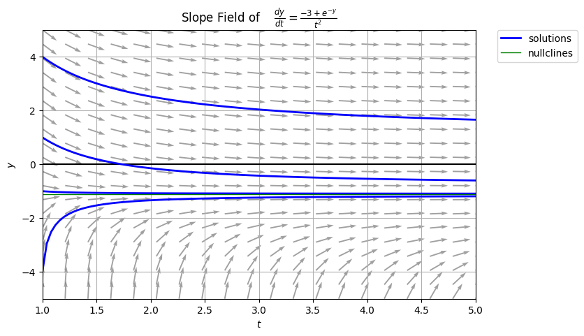
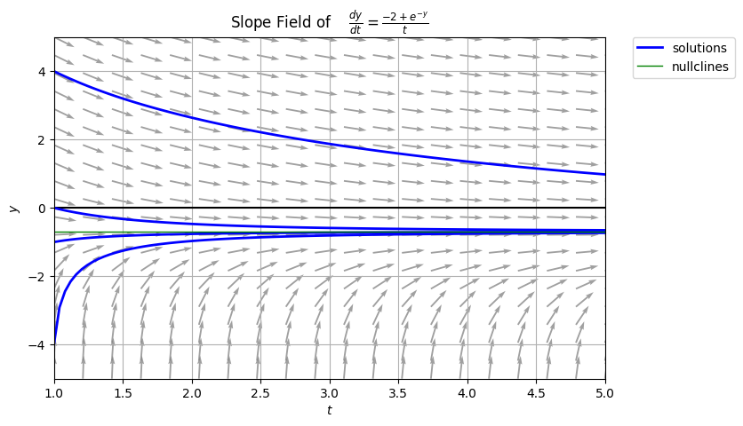
```

```{r echo=FALSE, out.width = '49%', fig.align='center', fig.show='hold'}
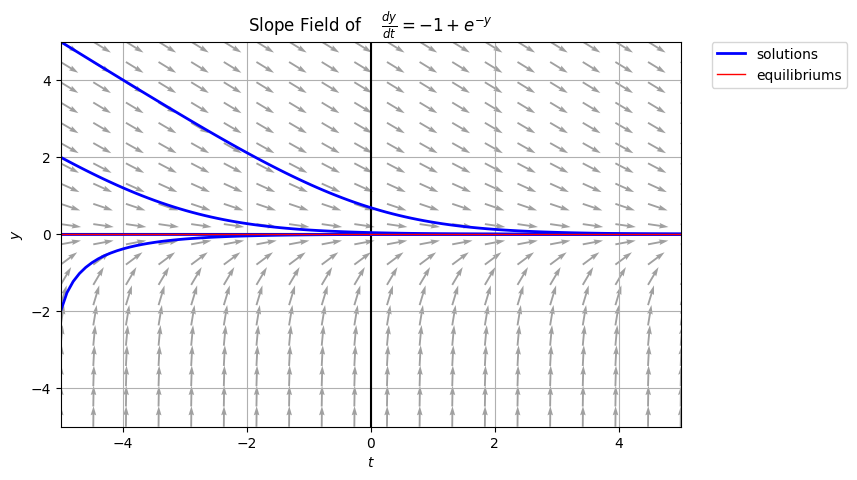
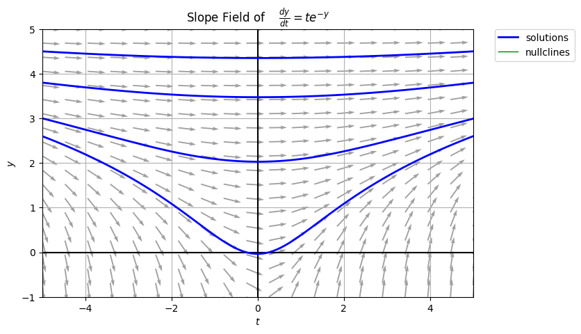
```
  
  \task Find the general solution of the given differential equation for each case of $n$.
  
  \textcolor{blue}{
  For all cases, the ODE is separable. So, the SOV method is appropriate to use.
  \begin{multicols}{2}
  \begin{itemize}
    \item Case: $n = -2$; $\displaystyle y' = t^{-2} \left(e^{-y} - 3\right)$
        $$
        \begin{aligned}
        \frac{dy}{\left(e^{-y} - 3\right)} & = t^{-2} \ dt \\
        \int \frac{dy}{\left(e^{-y} - 3\right)} & = \int t^{-2} \ dt \\
        \frac{-\ln{\left( e^{-y} - 3 \right)}-y}{3} & = -\frac{1}{t} + A \\
        -\ln{\left( e^{-y} - 3 \right)}-y & = -\frac{3}{t} + B \\
        \ln{\left( e^{-y} - 3 \right)}+y & = \frac{3}{t} + C \\
        \left(e^{-y} - 3\right) e^{y} & = De^{\frac{3}{t}} \\
        1-3e^{-y} & = De^{\frac{3}{t}} \\
        e^{y} & = \frac{1}{3} - E e^{\frac{3}{t}} \\
        y & = \ln{\left( \frac{1}{3} - C_1 e^{\frac{3}{t}} \right)}
        \end{aligned}
        $$
    \item Case: $n = -1$; $\displaystyle y' = t^{-1} \left(e^{-y} - 2\right)$
        $$
        \begin{aligned}
        y' & = t^{-1} \left(e^{-y} - 2\right) \\
        \frac{dy}{\left(e^{-y} - 2\right)} & = t^{-1} \ dt \\
        \int \frac{dy}{\left(e^{-y} - 2\right)} & = \int t^{-1} \ dt \\
        \frac{-\ln{\left( e^{-y} - 2 \right)}-y}{2} & = \ln{(t)} + A \\
        -\ln{\left( e^{-y} - 2 \right)}-y & = 2\ln{(t)} + B \\
        \ln{\left( e^{-y} - 2 \right)}+y & B - 2\ln{(t)} \\
        \left( e^{-y} - 2 \right) e^{y} & = \frac{C}{t^2} \\
        1 - 2e^{y} & = \frac{C}{t^2} \\
        e^{y} & = \frac{1}{2} + \frac{E}{t^2} \\
        y & = \ln{\left( \frac{1}{2} + \frac{C_1}{t^2} \right)}
        \end{aligned}
        $$
    \item Case: $n = 0$; $\displaystyle y' = \left(e^{-y} - 1\right)$
      $$
      \begin{aligned}
      y' & = \left(e^{-y} - 1\right) \\
      \frac{dy}{\left(e^{-y} - 1\right)} & = dt \\
      \int \frac{dy}{\left(e^{-y} - 1\right)} & = \int dt \\
      -\ln{\left( e^{-y} - 1 \right)}-y & = t + A \\
      \ln{\left( e^{-y} - 1 \right)}+y & = B - t \\
      \left( e^{-y} - 1 \right) e^{y} & = Ce^{-t} \\
      1 - e^{y} & = De^{-t} \\
      e^{y} & = Ee^{-t} + 1 \\
      y & = \ln{\left( C_1e^{-t} + 1 \right)}
      \end{aligned}
      $$
    \item Case: $n = 1$; $\displaystyle y' = t \left(e^{-y}\right)$
      $$
      \begin{aligned}
      y' & = t \left(e^{-y}\right) \\
      \frac{dy}{\left(e^{-y}\right)} & = t \ dt \\
      \int \frac{dy}{\left(e^{-y}\right)} & = \int t \ dt \\
      e^{y} & = \frac{t^2}{2} + A \\
      y & = \ln{\left( \frac{t^2}{2} + C_1 \right)}
      \end{aligned}
      $$
  \end{itemize}
  \end{multicols}
  }
  
  \task Explain on what happens to the solutions of the differential equation as $t \to -\infty$, $t \to 0$, and $t \to +\infty$ for each case of $n$.
  
  \textcolor{blue}{
  \begin{multicols}{2}
  \begin{itemize}
    \item Case: $n = -2$; $\displaystyle y = \ln{\left( \frac{1}{3} - C_1 e^{\frac{3}{t}} \right)}$
        $$
        \begin{aligned}
        \lim_{t \to -\infty} y & = \ln{\left( \frac{1}{3} - C_1 \right)} \\
        \lim_{t \to 0} & = \text{DNE} \\
        \lim_{t \to +\infty} & = \ln{\left( \frac{1}{3} - C_1 \right)}
        \end{aligned}
        $$
    \item Case: $n = -1$; $\displaystyle y = \ln{\left( \frac{1}{2} + \frac{C_1}{t^2} \right)}$
        $$
        \begin{aligned}
        \lim_{t \to -\infty} y & = \ln{\left( \frac{1}{2} \right)} \\
        \lim_{t \to 0} & = \text{DNE} \\
        \lim_{t \to +\infty} & = \ln{\left( \frac{1}{2} \right)}
        \end{aligned}
        $$
    \item Case: $n = 0$; $\displaystyle y = \ln{\left( C_1e^{-t} + 1 \right)}$
        $$
        \begin{aligned}
        \lim_{t \to -\infty} y & = \text{DNE} \\
        \lim_{t \to 0} & = \ln{\left( C_1 + 1 \right)} \\
        \lim_{t \to +\infty} & = 0
        \end{aligned}
        $$
    \item Case: $n = 1$; $\displaystyle y = \ln{\left( \frac{t^2}{2} + C_1 \right)}$
        $$
        \begin{aligned}
        \lim_{t \to -\infty} y & = \text{DNE} \\
        \lim_{t \to 0} & = \ln{\left( C_1 \right)} \\
        \lim_{t \to +\infty} & = \text{DNE}
        \end{aligned}
        $$
  \end{itemize}
  \end{multicols}
  }
\end{tasks}

<!-- \newpage

## **References**

::: {#refs}
:::

<br> -->
