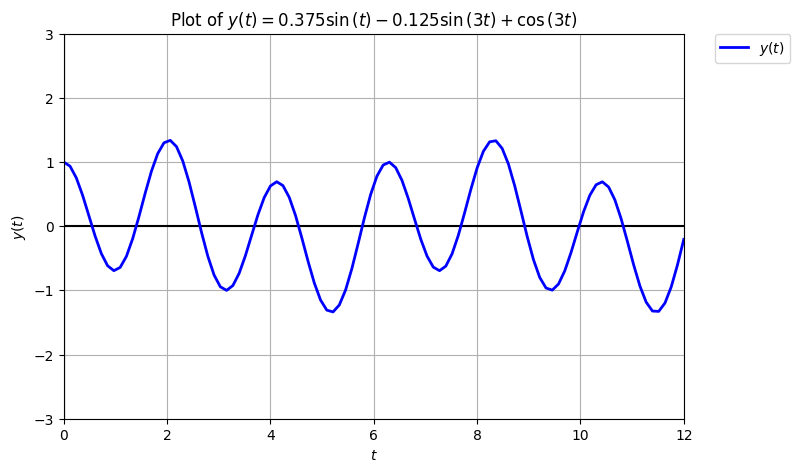
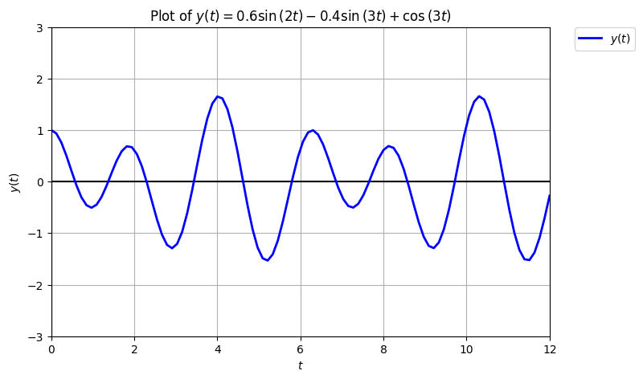
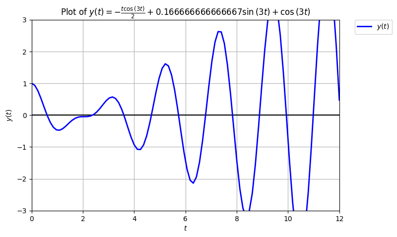

```{r setup, include=FALSE}
knitr::opts_chunk$set(echo = TRUE)
source(file.path("../../R/functions-mth321.R"))
```

**Instructions:** Homework is graded primarily on correctness and completion.

* Write your solutions on separate sheets of paper with your name written on each problem.
* Include all key steps and explanations that justify your answers, unless it says otherwise.
* Submit your written work as a `.pdf` file.
* Attach all supporting files as a `.zip` file if applicable.

\noindent\rule{\textwidth}{1pt}

## Homework Set 3

### 1. 

For each linear homogeneous 2nd-order ODE with constant coefficients: 

  (i) find the characteristic equation, 
  (ii) solve for the roots of the characteristic equation, and 
  (iii) determine the general and specific solution of the ODE.

\begin{tasks}(2)
  \task $\displaystyle y'' - 2y' - 2y = 0; \quad y(0) = 1, \quad y'(0) = 1$
  \task $\displaystyle y'' = 6y' - 9y; \quad y(0) = 1, \quad y'(0) = 0$
  \task $\displaystyle y'' + y' + y = 0; \quad y(0) = 0, \quad y'(0) = 1$
  \task $\displaystyle y'' = -2y; \quad y(0) = 1, \quad y'(0) = 1$
\end{tasks}

\textcolor{blue}{
\begin{itemize}
  \item[(a)] $\displaystyle y'' - 2y' - 2y = 0; \quad y(0) = 1, \quad y'(0) = 1$
    \begin{itemize}
      \item[(i)] The characteristic equation is $\displaystyle r^2 - 2r - 2 = 0$ given the Ansatz $\displaystyle y = e^{rt}$.
      \item[(ii)] 
      $$
      \begin{aligned}
      r^2 - 2r - 2 & = 0 \\
      r & = \frac{-(-2) \pm \sqrt{(-2)^2 - 4\left(1\right)(-2)}}{2\left(1\right)} \\
      r & = \frac{2 \pm 2\sqrt{3}}{2} \longrightarrow r_1 = 1 - \sqrt{3} \text{ and } r_2 = 1 + \sqrt{3}
      \end{aligned}
      $$
      \item[(iii)]
        $$
        \begin{aligned}
        y & = c_1 e^{\left(1 - \sqrt{3} \right) t} + c_2 e^{\left(1 + \sqrt{3} \right) t} \longleftarrow \text{general solution} \\
        y' & = c_1 \left(1 - \sqrt{3} \right) e^{\left(1 - \sqrt{3} \right) t} + c_2 \left(1 + \sqrt{3} \right) e^{\left(1 + \sqrt{3} \right) t} \\
          & \downarrow \\
        1 & = c_1 + c_2 \\
        1 & = c_1 \left(1 - \sqrt{3} \right) + c_2 \left(1 + \sqrt{3} \right) \\
          & \downarrow \\
        c_1 & = \frac{1}{2} \\
        c_2 & = \frac{1}{2} \\
          & \downarrow \\
        y & = \frac{1}{2} e^{\left(1 - \sqrt{3} \right) t} + \frac{1}{2} e^{\left(1 + \sqrt{3} \right) t} \longleftarrow \text{specific solution}
        \end{aligned}
        $$
    \end{itemize}
  \item[(b)] $\displaystyle y'' = 6y' - 9y; \quad y(0) = 1, \quad y'(0) = 0$
    \begin{itemize}
      \item[(i)] The characteristic equation is $\displaystyle r^2 - 6r + 9 = 0$ given the Ansatz $\displaystyle y = e^{rt}$.
      \item[(ii)] 
      $$
      \begin{aligned}
      r^2 - 6r + 9 & = 0 \\
      (r-3)^2 & = 0 \\
      r & = 3 \longrightarrow \text{ with multiplicity of 2}
      \end{aligned}
      $$
      \item[(iii)]
        $$
        \begin{aligned}
        y & = c_1 e^{3 t} + c_2 t e^{3 t} \longleftarrow \text{general solution} \\
        y' & = 3 c_1 e^{3 t} + c_2 e^{3 t} (1+3t) \\
          & = \downarrow \\
        1 & = c_1 \\
        0 & = 3c_1 + c_2 \\
          & \downarrow \\
        c_1 & = 1 \\
        c_2 & = -3 \\
          & \downarrow \\
        y & = 1 e^{3 t} - 3 t e^{3 t} \longleftarrow \text{specific solution}
        \end{aligned}
        $$
    \end{itemize}
  \item[(c)] $\displaystyle y'' + y' + y = 0; \quad y(0) = 0, \quad y'(0) = 1$
    \begin{itemize}
      \item[(i)] The characteristic equation is $\displaystyle r^2 + r + 1 = 0$ given the Ansatz $\displaystyle y = e^{rt}$.
      \item[(ii)] 
      $$
      \begin{aligned}
      r^2 + r + 1 & = 0 \\
      r & = \frac{-(1) \pm \sqrt{(1)^2 - 4(1)(1)}}{2(1)} \\
      r & = \frac{-1 \pm \sqrt{-3}}{2} \longrightarrow r_1 = -\frac{1}{2} - \frac{\sqrt{3}}{2}i \text{ and } r_2 = -\frac{1}{2} + \frac{\sqrt{3}}{2}i
      \end{aligned}
      $$
      \item[(iii)]
        $$
        \begin{aligned}
        y & = e^{-\frac{1}{2} t} \left( c_1 \cos{\left( \frac{\sqrt{3}}{2} t \right)} + c_2 \sin{\left( \frac{\sqrt{3}}{2} t \right)} \right) \longleftarrow \text{general solution} \\
        y' & = -\frac{1}{2} e^{-\frac{1}{2} t} \left( c_1 \cos{\left( \frac{\sqrt{3}}{2} t \right)} + c_2 \sin{\left( \frac{\sqrt{3}}{2} t \right)} \right) + \\
          & \quad e^{-\frac{1}{2} t} \left( - \frac{\sqrt{3}}{2} c_1 \sin{\left( \frac{\sqrt{3}}{2} t \right)} + \frac{\sqrt{3}}{2} c_2 \cos{\left( \frac{\sqrt{3}}{2} t \right)}  \right) \\
          & \downarrow \\
        0 & = c_1 \\
        1 & = c_1 + \frac{\sqrt{3}}{2} c_2 \\
          & \downarrow \\
        c_1 & = 0 \\
        c_2 & = \frac{2}{\sqrt{3}} \\
          & \downarrow \\
        y & = e^{-\frac{1}{2} t} \left( \frac{2}{\sqrt{3}} \sin{\left( \frac{\sqrt{3}}{2} t \right)} \right) \longleftarrow \text{specific solution}
        \end{aligned}
        $$
    \end{itemize}
  \item[(d)] $\displaystyle y'' = -2y; \quad y(0) = 1, \quad y'(0) = 1$
    \begin{itemize}
      \item[(i)] The characteristic equation is $\displaystyle r^2 + 2 = 0$ given the Ansatz $\displaystyle y = e^{rt}$.
      \item[(ii)] 
      $$
      \begin{aligned}
      r^2 + 2 & = 0 \\
      r^2 & = -2 \\
      r & = \pm \sqrt{-2} \longrightarrow r_1 = -i\sqrt{2} \text{ and } r_2 = +i\sqrt{2}
      \end{aligned}
      $$
      \item[(iii)]
        $$
        \begin{aligned}
        y & = c_1 \cos{\left( \sqrt{2} \ t \right)} + c_2 \sin{\left( \sqrt{2} \ t \right)} \longleftarrow \text{general solution} \\
        y' & = - \sqrt{2} \ c_1 \sin{\left( \sqrt{2} \ t \right)} + \sqrt{2} \ c_2 \cos{\left( \sqrt{2} \ t \right)} \\
          & \downarrow \\
        1 & = c_1 \\
        1 & = \sqrt{2} \ c_2 \\
          & \downarrow \\
        c_1 & = 1 \\
        c_2 & = \frac{1}{\sqrt{2}} \\
          & \downarrow \\
         y & = \cos{\left( \sqrt{2} \ t \right)} + \frac{1}{\sqrt{2}} \sin{\left( \sqrt{2} \ t \right)} \longleftarrow \text{specific solution}
        \end{aligned}
        $$
    \end{itemize}
\end{itemize}
}

### 2. 

For each linear non-homogeneous 2nd-order ODE with constant coefficients:

  (i) determine the homogeneous solution $y_h$,
  (ii) find the particular solution $y_p$ using either Undetermined Coefficients or Variation of Parameters, and
  (iii) write the general solution $y = y_h + y_p$ and determine the specific solution.

Make sure to specify what method you used to find the particular solution.

\begin{tasks}(2)
  \task $\displaystyle y'' - 2y' + y = e^{t}; \quad y(0) = 1, \quad y'(0) = 0$
  \task $\displaystyle y'' + y = \cos{(t)}; \quad y(0) = 0, \quad y'(0) = 1$
  \task $\displaystyle y'' - 2y' + 2y = 2; \quad y(0) = 0, \quad y'(0) = 1$
  \task $\displaystyle y'' + y' - 2y = e^{-2t}; \quad y(0) = 1, \quad y'(0) = 0$
\end{tasks}

\textcolor{blue}{
In each given ODE the forcing function $f(t)$ (RHS term) is in the table of common functions. So, undetermined coefficients can be used to find the particular solution to all of them. The method of variation of parameters can also be applied to all given ODEs to find the particular solution, given that the resulting integrals can be evaluated exactly or approximately.
\begin{itemize}
  \item[(a)] $\displaystyle y'' - 2y' + y = e^{t}; \quad y(0) = 1, \quad y'(0) = 0$
    \begin{itemize}
      \item \textit{Homogeneous solution:}
          $$
          \begin{aligned}
          r^2 - 2r + 1 & = 0 \longleftarrow \text{ characteristic equation} \\
          (r-1)^2 & = 0 \\
          r & = 1 \longleftarrow \text{ repeated real root}
          \end{aligned}
          $$
          $$
          y_h = c_1 e^{t} + c_2 t e^{t} \longleftarrow \text{ homogeneous solution}
          $$
      \item \textit{Particular solution:}
        \begin{itemize}
          \item \textbf{Undetermined coefficients:} Since $f(t) = e^{t}$, then let $y_p = At^2 e^{t}$ be the Ansatz. Here, $t$ is multiplied twice to the Ansatz because the homogeneous solution have identical structure with the initial Ansatz.
              $$
              \begin{aligned}
              y_p & = At^2e^{t} \\
              y'_p & = At^2e^{t} + 2At e^{t} \\
              y''_p & = At^2e^{t} + 4Ate^{t} + 2Ae^{t} \\
              \end{aligned}
              $$
              $$
              \begin{aligned}
              y''_p - 2y'_p + y_p & = e^{t} \\
              At^2e^{t} + 4Ate^{t} + 2Ae^{t} - 2\left( At^2e^{t} + 2At e^{t} \right) + At^2e^{t} & = e^{t} \\
              At^2e^{t} + 4Ate^{t} + 2Ae^{t} - 2At^2e^{t} - 4At e^{t} + At^2e^{t} & = e^{t} \\
              2Ae^{t} & = e^{t} \\
              2A & = 1 \\
              A & = \frac{1}{2}
              \end{aligned}
              $$
              $$
              y_p = \frac{1}{2}t^2e^{t} \longleftarrow \text{ particular solution}
              $$
          \item \textbf{Variation of parameters:} Let $y_1 = e^{t}$, $y_2 = t e^{t}$, and $f(t) = e^{t}$.
              $$
              \begin{aligned}
              y_1 = e^{t}, & \quad y'_1 = e^{t} \\
              y_2 = t e^{t}, & \quad y'_2 = e^{t}(t+1) \\
              \end{aligned}
              $$
              $$
              \begin{aligned}
              W & = y_1 y'_2 - y_2y'_1 \\
                & = e^{2t}(t+1) - t e^{2t} \\
              W & = e^{2t} \longleftarrow \text{ wronskian}
              \end{aligned}
              $$
              $$
              \begin{aligned}
              u_1 & = \int \frac{f(t)}{W} y_2 \ dt \\
                  & = \int \frac{e^{t}}{e^{2t}} t e^{t} \ dt \\
                  & = \int t \ dt \\
              u_1 & = \frac{t^2}{2}
              \end{aligned}
              $$
              $$
              \begin{aligned}
              u_2 & = \int \frac{f(t)}{W} y_1 \ dt \\
                  & = \int \frac{e^{t}}{e^{2t}} e^{t} \ dt \\
                  & = \int \ dt \\
              u_2 & = t
              \end{aligned}
              $$
              $$
              \begin{aligned}
              y_p & = -y_1u_1 + y_2u_2 \\
                  & = -e^{t} \frac{t^2}{2} + t^2 e^{t} \\
              y_p & = \frac{1}{2} t^2 e^{t} \longleftarrow \text{ particular solution}
              \end{aligned}
              $$
        \end{itemize}
      \item \textit{General solution:}
          $$
          \begin{aligned}
          y & = y_h + y_p \\
          y & = c_1 e^{t} + c_2 t e^{t} + \frac{1}{2} t^2 e^{t} \longleftarrow \text{ general solution}
          \end{aligned}
          $$
      \item \textit{Specific solution:} The initial conditions are $\displaystyle y(0) = 1$ and $\displaystyle y'(0) = 0$.
          $$
          \begin{aligned}
          y  & = c_1 e^{t} + c_2 t e^{t} + \frac{1}{2} t^2 e^{t} \\
          y' & = c_1 e^{t} + c_2 e^{t}(t+1) + \frac{1}{2}t^2e^{t} + t e^{t} \\
             & \downarrow \\
          y(0) & = c_1 \\
          y'(0) & = c_1 + c_2 \\
             & \downarrow \\
          1 & = c_1 \\
          0 & = c_1 + c_2 \\
            & \downarrow \\
          c_1 & = 1 \\
          c_2 & = -1
          \end{aligned}
          $$
          $$
          y = e^{t} - t e^{t} + \frac{1}{2} t^2 e^{t} \longleftarrow \text{ specific solution}
          $$
    \end{itemize}
  \item[(b)] $\displaystyle y'' + y = \cos{(t)}; \quad y(0) = 0, \quad y'(0) = 1$
    \begin{itemize}
      \item \textit{Homogeneous solution:}
          $$
          \begin{aligned}
          r^2 + 1 & = 0 \longleftarrow \text{ characteristic equation} \\
          r & = \sqrt{-1} \\
          r & = \pm i \longleftarrow \text{ imaginary roots}
          \end{aligned}
          $$
          $$
          y_h = c_1 \cos{(t)} + c_2 \sin{(t)} \longleftarrow \text{ homogeneous solution}
          $$
      \item \textit{Particular solution:}
        \begin{itemize}
          \item \textbf{Undetermined coefficients:} Since $f(t) = \cos{(t)}$, then let $y_p = t(A\cos{(t)} + B\sin{(t)})$ be the Ansatz. Here, $t$ is multiplied once to the Ansatz because the homogeneous solution have identical structure with the initial Ansatz.
              $$
              \begin{aligned}
              y_p & = A t \cos{(t)} + B t \sin{(t)} \\
              y'_p & = -A t \sin{(t)} + A \cos{(t)} + B t \cos{(t)} + B \sin{(t)}  \\
              y''_p & = -A t \cos{(t)} -A \sin{(t)} - A\sin{(t)} - B t \sin{(t)} + B \cos{(t)} + B \cos{(t)} \\
                    & = -A t \cos{(t)} -2A \sin{(t)} - B t \sin{(t)} + 2B \cos{(t)}
              \end{aligned}
              $$
              $$
              \begin{aligned}
              y'' + y & = \cos{(t)} \\
              -A t \cos{(t)} -2A \sin{(t)} - B t \sin{(t)} + 2B \cos{(t)} + A t \cos{(t)} + B t \sin{(t)} & = \cos{(t)} \\
              (-At + 2B + At)\cos{(t)} + (-2A -Bt + Bt)\sin{(t)} & = \cos{(t)} \\
              2B \cos{(t)} - 2A \sin{(t)} & = \cos{(t)} \\
              \downarrow & \\
              2B & = 1 \\
              -2A & = 0 \\
              \downarrow & \\
              B & = \frac{1}{2} \\
              A & = 0
              \end{aligned}
              $$
              $$
              y_p = \frac{1}{2} t \sin{(t)} \longleftarrow \text{ particular solution}
              $$
          \item \textbf{Variation of parameters:} Let $y_1 = \cos{(t)}$, $y_2 = \sin{(t)}$, and $f(t) = \cos{(t)}$.
              $$
              \begin{aligned}
              y_1 = \cos{(t)}, & \quad y'_1 = -\sin{(t)} \\
              y_2 = \sin{(t)}, & \quad y'_2 = \cos{(t)} \\
              \end{aligned}
              $$
              $$
              \begin{aligned}
              W & = y_1 y'_2 - y_2y'_1 \\
                & = \cos^2{(t)} + \sin^2{(t)} \\
              W & = 1 \longleftarrow \text{ wronskian}
              \end{aligned}
              $$
              $$
              \begin{aligned}
              u_1 & = \int \frac{f(t)}{W} y_2 \ dt \\
                  & = \int \frac{\cos{(t)}}{1} \sin{(t)} \ dt \\
                  & = \int \cos{(t)} \sin{(t)} \ dt \\
              u_1 & = \frac{\sin^2{(t)}}{2}
              \end{aligned}
              $$
              $$
              \begin{aligned}
              u_2 & = \int \frac{f(t)}{W} y_1 \ dt \\
                  & = \int \frac{\cos{(t)}}{1} \cos{(t)} \ dt \\
                  & = \int \cos^2{(t)} \ dt \\
              u_2 & = \frac{t}{2} + \frac{\sin{(t)\cos{(t)}}}{2}
              \end{aligned}
              $$
              $$
              \begin{aligned}
              y_p & = -y_1u_1 + y_2u_2 \\
                  & = -\cos{(t)} \frac{\sin^2{(t)}}{2} + \sin{(t)} \left( \frac{t}{2} + \frac{\sin{(t)\cos{(t)}}}{2} \right) \\
                  & = -\frac{\sin^2{(t)} \cos{(t)}}{2} + \frac{1}{2} t \sin{(t)} + \frac{\sin^2{(t)} \cos{(t)}}{2} \\
              y_p & = \frac{1}{2} t \sin{(t)} \longleftarrow \text{ particular solution}
              \end{aligned}
              $$
        \end{itemize}
      \item \textit{General solution:}
          $$
          \begin{aligned}
          y & = y_h + y_p \\
          y & = c_1 \sin{(t)} + c_2 \cos{(t)} + \frac{1}{2} t \sin{(t)} \longleftarrow \text{ general solution}
          \end{aligned}
          $$
      \item \textit{Specific solution:} The initial conditions are $\displaystyle y(0) = 0$ and $\displaystyle y'(0) = 1$.
          $$
          \begin{aligned}
          y & = c_1 \cos{(t)} + c_2 \sin{(t)} + \frac{1}{2} t \sin{(t)} \\
          y' & = -c_1 \sin{(t)} + c_2 \cos{(t)} + \frac{1}{2}t \cos{(t)} + \frac{1}{2} \sin{(t)} \\
          \downarrow & \\
          y(0) & = c_1 \\
          y'(0) & = c_2 \\
          \downarrow & \\
          c_1 & = 0 \\
          c_2 & = 1
          \end{aligned}
          $$
          $$
          \begin{aligned}
          y & = \sin{(t)} + \frac{1}{2} t \sin{(t)} \\
          y  & = \left(1 + \frac{t}{2} \right)\sin{(t)} \longleftarrow \text{ specific solution}
          \end{aligned}
          $$
    \end{itemize}
  \item[(c)] $\displaystyle y'' - 2y' + 2y = 2; \quad y(0) = 0, \quad y'(0) = 1$
    \begin{itemize}
      \item \textit{Homogeneous solution:}
          $$
          \begin{aligned}
          r^2 - 2r + 2 & = 0 \longleftarrow \text{ characteristic equation} \\
          r = \frac{-2 \pm \sqrt{(-2)^2 - 4(1)(2)}}{2}  & \longleftarrow r = 1 \pm i \text{ complex conjugate roots}
          \end{aligned}
          $$
          $$
          y_h = e^{t} \left( c_1 \sin{(t)} + c_2 \cos{(t)} \right) \longleftarrow \text{ homogeneous solution}
          $$
      \item \textit{Particular solution:}
        \begin{itemize}
          \item \textbf{Undetermined coefficients:} Since $f(t) = 2$, then let $y_p = A$ be the Ansatz.
              $$
              \begin{aligned}
              y_p & = A \\
              y'_p & = 0 \\
              y''_p & = 0
              \end{aligned}
              $$
              $$
              \begin{aligned}
              y''_p - 2y'_p + 2y_p & = 2 \\
              0 - 2(0) + 2A & = 2 \\
              A & = 1
              \end{aligned}
              $$
              $$
              y_p = 1 \longleftarrow \text{ particular solution}
              $$
          \item \textbf{Variation of parameters:} Let $y_1 = e^t \sin{(t)}$, $y_2 = e^t \cos{(t)}$, and $f(t) = 2$.
              $$
              \begin{aligned}
              y_1 = e^t \sin{(t)}, & \quad y'_1 = e^t \left(\sin{(t)} + \cos{(t)}\right) \\
              y_2 = e^t \cos{(t)}, & \quad y'_2 = e^{t} \left(\cos{(t)} - \sin{(t)}\right) \\
              \end{aligned}
              $$
              $$
              \begin{aligned}
              W & = y_1 y'_2 - y_2y'_1 \\
                & = e^t \sin{(t)} e^{t} \left(\cos{(t)} - \sin{(t)}\right) - e^t \cos{(t)} e^t \left(\sin{(t)} + \cos{(t)}\right) \\
                & = e^{2t} \left( \sin{(t)}\cos{(t)} - \sin^2{(t)} - \cos{(t)}\sin{(t)} - \cos^2{(t)} \right) \\
              W & = -e^{2t} \longleftarrow \text{ wronskian}
              \end{aligned}
              $$
              $$
              \begin{aligned}
              u_1 & = \int \frac{f(t)}{W} y_2 \ dt \\
                  & = \int \frac{2}{-e^{2t}} e^t \cos{(t)} \ dt \\
                  & = - 2 \int e^{-t} \cos{(t)} \ dt \\
              u_1 & = e^{-t} \left( \cos{(t)} - \sin{(t)} \right)
              \end{aligned}
              $$
              $$
              \begin{aligned}
              u_2 & = \int \frac{f(t)}{W} y_1 \ dt \\
                  & = \int \frac{2}{-e^{2t}} e^t \sin{(t)} \ dt \\
                  & = - 2 \int e^{-t} \sin{(t)} \ dt \\
              u_2 & = e^{-t} \left( \cos{(t)} + \sin{(t)} \right)
              \end{aligned}
              $$
              $$
              \begin{aligned}
              y_p & = -u_1y_1 + u_2y_2 \\
                  & = -e^{-t} \left( \cos{(t)} - \sin{(t)} \right) e^t \sin{(t)} + e^{-t} \left( \cos{(t)} + \sin{(t)} \right) e^t \cos{(t)} \\
                  & = -\cos{(t)} \sin{(t)} + \sin^2{(t)} + \cos^2{(t)} + \sin{(t)}\cos{(t)} \\ 
              y_p & = 1 \longleftarrow \text{ particular solution}
              \end{aligned}
              $$
        \end{itemize}
      \item \textit{General solution:}
          $$
          \begin{aligned}
          y & = y_h + y_p \\
          y & = e^{t} \left( c_1 \sin{(t)} + c_2 \cos{(t)} \right) + 1 \longleftarrow \text{ general solution}
          \end{aligned}
          $$
      \item \textit{Specific solution:} The initial conditions are $\displaystyle y(0) = 0$ and $\displaystyle y'(0) = 1$.
          $$
          \begin{aligned}
          y & = e^{t} \left( c_1 \sin{(t)} + c_2 \cos{(t)} \right) + 1  \\
          y' & = c_1 e^t \left(\sin{(t)} + \cos{(t)}\right) + c_2 e^{t} \left(\cos{(t)} - \sin{(t)}\right) \\
          \downarrow & \\
          0 & = c_2 + 1 \\
          1 & = c_1 + c_2 \\
          \downarrow & \\ 
          c_1 & = 2 \\
          c_2 & = -1
          \end{aligned}
          $$
          $$
          y = e^{t} \left( 2 \sin{(t)} - 1 \cos{(t)} \right) + 1 \longleftarrow \text{ specific solution}
          $$
    \end{itemize}
  \item[(d)] $\displaystyle y'' + y' - 2y = e^{-2t}; \quad y(0) = 1, \quad y'(0) = 0$
    \begin{itemize}
      \item \textit{Homogeneous solution:}
          $$
          \begin{aligned}
          r^2 + r - 2 & = 0 \longleftarrow \text{ characteristic equation} \\
          (r-1)(r+2) & = 0 \longleftarrow r_1 = 1 \text{, and } r_2 = -2 \text{ distinct real roots}
          \end{aligned}
          $$
          $$
          y_h = c_1 e^{t} + c_2 e^{-2t} \longleftarrow \text{ homogeneous solution}
          $$
      \item \textit{Particular solution:}
        \begin{itemize}
          \item \textbf{Undetermined coefficients:} Since $f(t) = e^{-2t}$, then let $y_p = A t e^{-2t}$ be the Ansatz. We multiply by $t$ because the initial trial solution was dependent with the $y_h$.
              $$
              \begin{aligned}
              y_p & = A t e^{-2t} \\
              y'_p & = Ae^{-2t}(1-2t) \\
              y''_p & = 4Ae^{-2t} (t-1)
              \end{aligned}
              $$
              $$
              \begin{aligned}
              y''_p + y'_p - 2y_p & = e^{-2t} \\
              4Ae^{-2t} (t-1) + Ae^{-2t}(1-2t) - 2 A t e^{-2t} & = e^{-2t} \\
              e^{-2t}(4At - 4A + A - 2At - 2At) & = e^{-2t} \\
              \downarrow & \\
              -3A & = 1 \\
              \downarrow & \\
              A & = -\frac{1}{3} 
              \end{aligned}
              $$
              $$
              y_p = -\frac{1}{3} t e^{-2t} \longleftarrow \text{ particular solution}
              $$
          \item \textbf{Variation of parameters:} Let $y_1 = e^{t}$, $y_2 = e^{-2t}$, and $f(t) = e^{-2t}$.
              $$
              \begin{aligned}
              y_1 = e^{t}, & \quad y'_1 = e^{t} \\
              y_2 = e^{-2t}, & \quad y'_2 = -2e^{-2t} \\
              \end{aligned}
              $$
              $$
              \begin{aligned}
              W & = y_1 y'_2 - y_2y'_1 \\
                & = -2e^{-t} -e^{-t} \\
              W & = -3e^{-t} \longleftarrow \text{ wronskian}
              \end{aligned}
              $$
              $$
              \begin{aligned}
              u_1 & = \int \frac{f(t)}{W} y_2 \ dt \\
                  & = \int \frac{e^{-2t}}{-3e^{-t}} e^{-2t} \ dt \\
                  & = -\frac{1}{3} \int e^{-3t} \ dt \\
              u_1 & = -\frac{1}{9} e^{-3t}
              \end{aligned}
              $$
              $$
              \begin{aligned}
              u_2 & = \int \frac{f(t)}{W} y_1 \ dt \\
                  & = \int \frac{e^{-2t}}{-3e^{-t}} e^{t} \ dt \\
                  & = - \frac{1}{3} \int 1 \ dt \\
              u_2 & = -\frac{1}{3} t
              \end{aligned}
              $$
              $$
              \begin{aligned}
              y_p & = -u_1y_1 + u_2y_2 \\
                  & = -\left(-\frac{1}{9} e^{-3t}\right) e^t - \frac{1}{3} t e^{-2t} \\
              y_p & = \frac{1}{9} e^{-2t} - \frac{1}{3} t e^{-2t} \longleftarrow \text{ particular solution}
              \end{aligned}
              $$
        \end{itemize}
      \item \textit{General solution:}
          $$
          \begin{aligned}
          y & = y_h + y_p \\
          y & = c_1 e^{t} + c_2 e^{-2t} -\frac{1}{3} t e^{-2t} \longleftarrow \text{ general solution}
          \end{aligned}
          $$
      \item \textit{Specific solution:} The initial conditions are $\displaystyle y(0) = 1$ and $\displaystyle y'(0) = 0$.
          $$
          \begin{aligned}
          y & = c_1 e^{t} + c_2 e^{-2t} -\frac{1}{3} t e^{-2t} \\
          y' & = c_1 e^{t} -2c_2 e^{-2t} + \frac{1}{3} e^{-2t}(2t-1) \\
          \downarrow & \\
          1 & = c_1 + c_2 \\
          0 & = c_1 - 2c_2 - \frac{1}{3} \\
          \downarrow & \\ 
          c_1 & = \frac{7}{9} \\
          c_2 & = \frac{2}{9}
          \end{aligned}
          $$
          $$
          y = \frac{7}{9} e^{t} + \frac{2}{9} e^{-2t} -\frac{1}{3} t e^{-2t} \longleftarrow \text{ specific solution}
          $$
    \end{itemize}
\end{itemize}
}

\newpage

### 3. 

Consider the linear 2nd-order ODE with constant coefficients:

$$y''- y' = f(t).$$

Use either Undetermined Coefficients or Variation of Parameters to find the particular solution for each case of $f(t)$. Make sure to specify what method you used to find the particular solution.

\begin{tasks}(4)
  \task $\displaystyle f(t) = 0$
  \task $\displaystyle f(t) = 1$
  \task $\displaystyle f(t) = \frac{1}{1 + e^{-t}}$
  \task $\displaystyle f(t) = e^{t}\left( \sin{(t)} + 1 \right)$
\end{tasks}

\textcolor{blue}{
\begin{itemize}
  \item[(a)] $\displaystyle f(t) = 0$ \\
      This is the homogeneous case.
      $$
      \begin{aligned}
      r^2 - r & = 0 \longleftarrow \text{ characterstic equation} \\
      r(r-1) & = 0 \longleftarrow r_1 = 0 \text{ and } r_2 = 1
      \end{aligned}
      $$
      Since the roots of the characteristic equation are distinct real, then the homogeneous solution (which is also the general solution for this case) is 
      $$
      y_h = c_1 + c_2e^{t} \longleftarrow \text{ general solution (homogeneous case)}.
      $$
  \item[(b)] $\displaystyle f(t) = 1$
    \begin{itemize}
      \item \textit{Undetermined coefficients:}
          Let $y_p = At$ be the Ansatz. The initial Ansats was multiplied by $t$ because of an identical term in the homogeneous solution $y_h$, solved in Part (a).
          $$
          \begin{aligned}
          y_p & = At \\
          y'_p & = A \\
          y''_p & = 0
          \end{aligned}
          $$
          $$
          \begin{aligned}
          y''_p - y'_p & = 1 \\
          0 - A & = 1 \\
          \downarrow & \\
          A & = - 1
          \end{aligned}
          $$
          $$
          y_p = -t \longleftarrow \text{ particular solution}
          $$
      \item \textit{Variation of parameters:} Let $y_1 = 1$ and $y_2 = e^t$.
          $$
          \begin{aligned}
          y_1 = 1, & \quad y'_1 = 0 \\
          y_2 = e^t, & \quad y'_2 = e^t \\
          \end{aligned}
          $$
          $$
          \begin{aligned}
          W & = y_1 y'_2 - y_2y'_1 \\
          W & = e^t \longleftarrow \text{ wronskian}
          \end{aligned}
          $$
          $$
          \begin{aligned}
          u_1 & = \int \frac{f(t)}{W} y_2 \ dt \\
              & = \int \frac{1}{e^t} e^t \ dt \\
              & = \int 1 \ dt \\
          u_1 & = t
          \end{aligned}
          $$
          $$
          \begin{aligned}
          u_2 & = \int \frac{f(t)}{W} y_1 \ dt \\
              & = \int \frac{1}{e^t} \ dt \\
          u_2 & = - e^{-t}
          \end{aligned}
          $$
          $$
          \begin{aligned}
          y_p & = -u_1 y_1 + u_2 y_2 \\
              & = -t - e^{-t} e^t \\
          y_p & = - t - 1
          \end{aligned}
          $$
    \end{itemize}
  \item[(c)] $\displaystyle f(t) = \frac{1}{1 + e^{-t}}$
    \begin{itemize}
      \item \textit{Undetermined coefficients:} Not applicable since $f(t)$ is not one of the common functions in the table of trial solutions.
      \item \textit{Variation of parameters:} Let $y_1 = 1$ and $y_2 = e^t$.
          $$
          \begin{aligned}
          y_1 = 1, & \quad y'_1 = 0 \\
          y_2 = e^t, & \quad y'_2 = e^t \\
          \end{aligned}
          $$
          $$
          \begin{aligned}
          W & = y_1 y'_2 - y_2y'_1 \\
          W & = e^t \longleftarrow \text{ wronskian}
          \end{aligned}
          $$
          $$
          \begin{aligned}
          u_1 & = \int \frac{f(t)}{W} y_2 \ dt \\
              & = \int \frac{\frac{1}{1 + e^{-t}}}{e^t} e^t \ dt \\
              & = \int \frac{1}{1 + e^{-t}} \ dt \\
          u_1 & = \ln{(e^t + 1)}
          \end{aligned}
          $$
          $$
          \begin{aligned}
          u_2 & = \int \frac{f(t)}{W} y_1 \ dt \\
              & = \int \frac{\frac{1}{1 + e^{-t}}}{e^t} \ dt \\
              & = \int \frac{1}{e^t + 1} \ dt \\
          u_2 & = -2 \text{arcoth}(2e^t + 1)
          \end{aligned}
          $$
          $$
          \begin{aligned}
          y_p & = -u_1 y_1 + u_2 y_2 \\
          y_p & = - \ln{(e^t + 1)} -2 \text{arcoth}(2e^t + 1) e^t \longleftarrow \text{ particular solution}
          \end{aligned}
          $$
    \end{itemize}
  \item[(d)] $\displaystyle f(t) = e^{t}\left( \sin{(t)} + 1 \right)$
    \begin{itemize}
      \item \textit{Undetermined coefficients:} 
        Let $y_p = e^t \left( A \sin{(t)} + B \cos{(t)}\right) + Cte^t$ be the Ansatz. The initial Ansats was multiplied by $t$ because of an identical term in the homogeneous solution $y_h$, solved in Part (a).
          $$
          \begin{aligned}
          y_p & = e^t \left( A \sin{(t)} + B \cos{(t)}\right) + Cte^t \\
          y'_p & = e^t \left( (A-B) \sin{(t)} + (A+B) \cos{(t)} + C (t + 1) \right) \\
          y''_p & = e^t \left( 2A \cos{(t)} - 2B \sin{(t)} + C (t+2) \right)
          \end{aligned}
          $$
          $$
          \begin{aligned}
          y''_p - y'_p & = e^{t}\left( \sin{(t)} + 1 \right) \\
          e^t \left( 2A \cos{(t)} - 2B \sin{(t)} + C (t+2) \right) - \\
            \left(e^t \left( (A-B) \sin{(t)} + (A+B) \cos{(t)} + C (t + 1) \right)\right) & = e^{t}\left( \sin{(t)} + 1 \right) \\
          \downarrow & \\
          -A + B & = 0 \\
          -A - B & = 1 \\
          C & = 1 \\
            & \downarrow \\
          A & = -\frac{1}{2} \\
          B & = -\frac{1}{2} \\
          C & = 1
          \end{aligned}
          $$
          $$
          y_p = e^t \left( -\frac{1}{2} \sin{(t)} - \frac{1}{2} \cos{(t)}\right) + te^t \longleftarrow \text{ particular solution}
          $$
      \item \textit{Variation of parameters:} Let $y_1 = 1$ and $y_2 = e^t$.
          $$
          \begin{aligned}
          y_1 = 1, & \quad y'_1 = 0 \\
          y_2 = e^t, & \quad y'_2 = e^t \\
          \end{aligned}
          $$
          $$
          \begin{aligned}
          W & = y_1 y'_2 - y_2y'_1 \\
          W & = e^t \longleftarrow \text{ wronskian}
          \end{aligned}
          $$
          $$
          \begin{aligned}
          u_1 & = \int \frac{f(t)}{W} y_2 \ dt \\
              & = \int \frac{e^{t}\left( \sin{(t)} + 1 \right)}{e^t} e^t \ dt \\
              & = \int e^{t}\left( \sin{(t)} + 1 \right) \ dt \\
          u_1 & = \frac{1}{2} e^t \left( \sin{(t)} - \cos{(t)} + 2 \right)
          \end{aligned}
          $$
          $$
          \begin{aligned}
          u_2 & = \int \frac{f(t)}{W} y_1 \ dt \\
              & = \int \frac{e^{t}\left( \sin{(t)} + 1 \right)}{e^t} \ dt \\
              & = \int \left( \sin{(t)} + 1 \right) \ dt \\
          u_2 & = -\cos{(t)} + t
          \end{aligned}
          $$
          $$
          \begin{aligned}
          y_p & = -u_1 y_1 + u_2 y_2 \\
          y_p & = - \frac{1}{2} e^t \left( \sin{(t)} - \cos{(t)} + 2 \right) - \left(\cos{(t)} + t \right) e^t \\
          y_p & = e^t \left( - \frac{1}{2} \sin{(t)} -\frac{1}{2} \cos{(t)} - 1 - t \right)  \longleftarrow \text{ particular solution}
          \end{aligned}
          $$
    \end{itemize}
\end{itemize}
}

### 4. 

Resonance occurs when a system is forced at its natural frequency, leading to a build-up of the amplitude of oscillation and energy. In other words, it occurs when the frequency of the non-homogeneous term matches the frequency of the homogeneous solution.

To illustrate resonance in its simplest form, consider the following linear non-homogeneous 2nd-order ODE with constant coefficients: $$y'' + 9 y = 3\sin{(\omega t)}; \quad y(0) = 1, \quad y'(0) = 0$$ where $\omega$ is a real number.

\begin{tasks}
  \task Determine the homogeneous solution.
  \task For each value of $\omega$, find the particular solution using either Undetermined Coefficients or Variation of Parameters. Make sure to specify what method you used to find the particular solution.
    \begin{itemize}
      \item[i.] $\displaystyle \omega = 1$
      \item[ii.] $\displaystyle \omega = 2$
      \item[iii.] $\displaystyle \omega = 3$
    \end{itemize}
  \task Write the general solution and determine the specific solution for each value of $\omega$ in Part (b).
  \task Use a graphing technology to plot the specific solutions determined in Part (c).
  \task Describe your observations of the behavior of solutions as $\omega$ approaches the frequency of the homogeneous solution.
\end{tasks}

\textcolor{blue}{
\begin{itemize}
  \item[(a)] The companion homogeneous ODE is $y'' + 9 y = 0$.
      $$
      \begin{aligned}
      r^2 + 9 & = 0 \longleftarrow \text{ characteristic equation} \\
      r^2 & = -9 \\
      r & = \pm \sqrt{-9} \longleftarrow r_1 = -3i \text{ and } r_2 = +3i
      \end{aligned}
      $$
      Since the roots of the characteristic equation are imaginary, the homogeneous solution is
      $$
      y_h = c_1 \cos{(3t)} + c_2 \sin{(3t)}.
      $$
  \item[(b)] We are given a non-homogeneous ODE of the form $y'' + 9 y = 3\sin{(\omega t)}$.
      Either undetermined coefficients and variation of parameters can be used to solve for the particular solution because the structure of $f(t)$ is in the common family of functions.
    \begin{itemize}
      \item \textit{Undetermined coefficients:}
        \begin{itemize}
          \item Assuming $\omega \ne 3$.
              Let $y_p = A \cos{(\omega t)} + B \sin{(\omega t)}$.
              $$
              \begin{aligned}
              y_p & = A \cos{(\omega t)} + B \sin{(\omega t)} \\
              y'_p & = -A \omega \sin{(\omega t)} + B \omega \cos{(\omega t)} \\
              y''_p & = -A \omega^2 \cos{(\omega t)} - B \omega^2 \sin{(\omega t)}
              \end{aligned}
              $$
              $$
              \begin{aligned}
              y''_p + 9 y_p & = 3\sin{(\omega t)} \\
              -A \omega^2 \cos{(\omega t)} - B \omega^2 \sin{(\omega t)} + 9 (A \cos{(\omega t)} + B \sin{(\omega t)}) & = 3\sin{(\omega t)} \\
              A\left( 9 -  \omega^2 \right)\cos{(\omega t)} + B\left( 9 -  \omega^2 \right) \sin{(t)} = 3 \sin{(\omega t)} \\
              \downarrow & \\
              A(9 -  \omega^2) & = 0 \\
              B(9 -  \omega^2) & = 3 \\
              \downarrow & \\
              A & = 0 \\
              B & = \frac{3}{9 - \omega^2}
              \end{aligned}
              $$
              $$
              y_p = \left( \frac{3}{9 - \omega^2} \right) \sin{(\omega t)} \longleftarrow \text{ particular solution if } \omega \ne 3
              $$
            \begin{itemize}
              \item $\omega = 1$:
                  $$
                  y_p = \left( \frac{3}{8} \right) \sin{(t)}
                  $$
              \item $\omega = 2$:
                  $$
                  y_p = \left( \frac{3}{5} \right) \sin{(2t)}
                  $$
            \end{itemize}
          \item Assuming $\omega = 3$.
              Let $y_p = A t \cos{(3 t)} + B t \sin{(3 t)}$. The initial Ansatz is multiplied by $t$ because it has identical structure as the homogeneous solution.
              $$
              \begin{aligned}
              y_p & = A t \cos{(3 t)} + B t \sin{(3 t)} \\
              y'_p & = -3At \sin{(3t)} + A \cos{(3t)} + 3Bt \cos{(3t)} + B \sin{(3t)} \\
              y''_p & = -9At \cos{(3t)} - 6A \sin{(3t)} - 9Bt \sin{(3t)} + 6B\cos{(3t)}
              \end{aligned}
              $$
              $$
              \begin{aligned}
              y''_p + 9 y_p & = 3\sin{(3 t)} \\
              -9At \cos{(3t)} - 6A \sin{(3t)} - 9Bt \sin{(3t)} + 6B\cos{(3t)} + 9(A t \cos{(3 t)} + B t \sin{(3 t)}) & = 3\sin{(3 t)} \\
              - 6A \sin{(3t)} + 6B\cos{(3t)} & = 3\sin{(3 t)} \\
              \downarrow & \\
              -6A & = 3 \\
              6B & = 0 \\
              \downarrow & \\
              A & = -\frac{1}{2} \\
              B & = 0
              \end{aligned}
              $$
              $$
              y_p = -\frac{1}{2} t \cos{(3 t)} \longleftarrow \text{ particular solution if } \omega = 3
              $$
        \end{itemize}
      \item \textit{Variation of parameters:} Let $y_1 = \cos{(3 t)}$, $y_2 = \sin{(3 t)}$, and $f(t) = 3\sin{(\omega t)}$.
        \begin{itemize}
          \item Assume $\omega \ne 3$.
              $$
              \begin{aligned}
              y_1 = \cos{(3 t)}, & \quad y'_1 = -3 \sin{(3 t)} \\
              y_2 = \sin{(3 t)}, & \quad y'_2 = 3 \cos{(3t)} \\
              \end{aligned}
              $$
              $$
              \begin{aligned}
              W & = y_1 y'_2 - y_2y'_1 \\
                & = \cos{(3 t)} 3 \cos{(3t)} - \sin{(3 t)}(-3 \sin{(3 t)}) \\
                & = 3 \cos^2{(3 t)} + 3 \sin^2{(3 t)} \\
              W & = 3 \longleftarrow \text{ wronskian}
              \end{aligned}
              $$
              $$
              \begin{aligned}
              u_1 & = \int \frac{f(t)}{W} y_2 \ dt \\
                  & = \int \frac{3\sin{(\omega t)}}{3} \sin{(3t)} \ dt \\
                  & = \int \sin{(\omega t)}\sin{(3t)} \\
              u_1 & = \left(\frac{3}{\omega^2 - 9} \right) \sin{(\omega t)}\cos{(3 t)} - \left( \frac{\omega}{\omega^2 - 9} \right) \sin{(3t)}\cos{(\omega t)}
              \end{aligned}
              $$
              $$
              \begin{aligned}
              u_2 & = \int \frac{f(t)}{W} y_1 \ dt \\
                  & = \int \frac{3\sin{(\omega t)}}{3} \cos{(3 t)} \ dt \\
                  & = \int \sin{(\omega t)} \cos{(3 t)} \ dt \\
              u_2 & = -\left(\frac{3}{\omega^2 - 9} \right) \sin{(3t)}\sin{(\omega t)} - \left( \frac{\omega}{\omega^2 - 9} \right)\cos{(3t)}\cos{(\omega t)}
              \end{aligned}
              $$
              $$
              \begin{aligned}
              y_p & = -u_1y_1 + u_2y_2 \\
                  & = -\left( \left(\frac{3}{\omega^2 - 9} \right) \sin{(\omega t)}\cos{(3 t)} - \left( \frac{\omega}{\omega^2 - 9} \right) \sin{(3t)}\cos{(\omega t)} \right) \cos{(3t)} \\
                  & \quad + \left(-\left(\frac{3}{\omega^2 - 9} \right) \sin{(3t)}\sin{(\omega t)} - \left( \frac{\omega}{\omega^2 - 9} \right)\cos{(3t)}\cos{(\omega t)}\right) \sin{(3t)} \\
                  & = - \left(\frac{3}{\omega^2 - 9} \right) \sin{(\omega t)}\cos^2{(3 t)} + \left( \frac{\omega}{\omega^2 - 9} \right) \sin{(3t)}\cos{(\omega t)} \cos{(3t)} \\
                  & \quad -\left(\frac{3}{\omega^2 - 9} \right) \sin^2{(3t)}\sin{(\omega t)} - \left( \frac{\omega}{\omega^2 - 9} \right)\cos{(3t)}\cos{(\omega t)}\sin{(3t)} \\
                  & = - \left(\frac{3}{\omega^2 - 9} \right) \sin{(\omega t)}\cos^2{(3 t)} - \left(\frac{1}{\omega^2 - 9} \right) \sin^2{(3t)}\sin{(\omega t)} \\
                  & = - \left(\frac{3}{\omega^2 - 9} \right) \sin{(\omega t)} \left( \cos^2{(3 t)} + \sin^2{(3 t)} \right) \\
              y_p & = \frac{3}{9 - \omega^2} \sin{(\omega t)} \longleftarrow \text{ particular solution if } \omega \ne 3
              \end{aligned}
              $$
          \item Assume $\omega = 3$.
              $$
              \begin{aligned}
              u_1 & = \int \frac{f(t)}{W} y_2 \ dt \\
                  & = \int \frac{3\sin{(3 t)}}{3} \sin{(3t)} \ dt \\
                  & = \int \sin^2{(3 t)} \\
              u_1 & = \frac{t}{2} - \frac{1}{6} \sin{(3t)}\cos{(3t)}
              \end{aligned}
              $$
              $$
              \begin{aligned}
              u_2 & = \int \frac{f(t)}{W} y_1 \ dt \\
                  & = \int \frac{3\sin{(3 t)}}{3} \cos{(3t)} \ dt \\
                  & = \int \sin{(3 t)}\cos{(3t)} \\
              u_2 & = -\frac{1}{6} \cos^2{(3t)}
              \end{aligned}
              $$
              $$
              \begin{aligned}
              y_p & = -u_1y_1 + u_2y_2 \\
                  & = -\left(\frac{t}{2} - \frac{1}{6} \sin{(3t)}\cos{(3t)}\right)\cos{(3t)} + \left(-\frac{1}{6} \cos^2{(3t)}\right)\sin{(3t)} \\
                  & = -\frac{t}{2} \cos{(3t)} + \frac{1}{6} \sin{(3t)}\cos^2{(3t)} - \frac{1}{6} \cos^2{(3t)}\sin{(3t)} \\
              y_p & = -\frac{t}{2} \cos{(3t)} \longleftarrow \text{ particular solution if } \omega = 3
              \end{aligned}
              $$
        \end{itemize}
    \end{itemize}
  \item[(c)] The initial conditions are $y(0) = 1$ and $y'(0) = 0$.
    \begin{itemize}
      \item[i.] $\displaystyle \omega = 1$
          $$
          y = c_1 \cos{(3t)} + c_2 \sin{(3t)} + \left( \frac{3}{8} \right) \sin{(t)} \longleftarrow \text{ general solution}
          $$
          $$
          \begin{aligned}
          y & = c_1 \cos{(3t)} + c_2 \sin{(3t)} + \left( \frac{3}{8} \right) \sin{(t)} \\
          y' & = -3 c_1 \sin{(3t)} + 3 c_2 \cos{(3t)} + \left( \frac{3}{8} \right)\cos{(t)} \\
          \downarrow & \\
          y(0) & = c_1 \\
          y'(0) & = 3c_2 + \frac{3}{8} \\
          \downarrow & \\
          1 & = c_1 \\
          0 & = 3c_2 + \frac{3}{8} \\
          \downarrow & \\
          c_1 & = 1 \\
          c_2 & = -\frac{1}{8}
          \end{aligned}
          $$
          $$
          y = \cos{(3t)} - \frac{1}{8} \sin{(3t)} + \left( \frac{3}{8} \right) \sin{(t)} \longleftarrow \text{ specific solution}
          $$
      \item[ii.] $\displaystyle \omega = 2$
          $$
          y = c_1 \cos{(3t)} + c_2 \sin{(3t)} + \left( \frac{3}{5} \right) \sin{(2t)} \longleftarrow \text{ general solution}
          $$
          $$
          \begin{aligned}
          y & = c_1 \cos{(3t)} + c_2 \sin{(3t)} + \left( \frac{3}{5} \right) \sin{(2t)} \\
          y' & = - 3 c_1 \sin{(3t)} + 3 c_2 \cos{(3t)} + 2 \left( \frac{3}{5} \right) \cos{(2t)} \\
          \downarrow & \\
          y(0) & = c_1 \\
          y'(0) & = 3c_2 + 2 \left( \frac{3}{5} \right) \\
          \downarrow & \\
          1 & = c_1 \\
          0 & = 3c_2 + 2 \left( \frac{3}{5} \right) \\
          \downarrow & \\
          c_1 & = 1 \\
          c_2 & = -\frac{2}{5}
          \end{aligned}
          $$
          $$
          y = \cos{(3t)} - \frac{2}{5} \sin{(3t)} + \left( \frac{3}{5} \right) \sin{(2t)} \longleftarrow \text{ specific solution}
          $$
      \item[iii.] $\displaystyle \omega = 3$
          $$
          y = c_1 \cos{(3t)} + c_2 \sin{(3t)} - \frac{t}{2} \cos{(3t)} \longleftarrow \text{ general solution}
          $$
          $$
          \begin{aligned}
          y & = c_1 \cos{(3t)} + c_2 \sin{(3t)} - \frac{t}{2} \cos{(3t)} \\
          y' & = - 3c_1 \sin{(3t)} + 3c_2 \cos{(3t)} - \left( -3\frac{t}{2}\sin{(3t)} + \frac{1}{2}\cos{(3t)} \right) \\
          \downarrow & \\
          y(0) & = c_1 \\
          y'(0) & = 3c_2 - \frac{1}{2} \\
          \downarrow & \\
          1 & = c_1 \\
          0 & = 3c_2 - \frac{1}{2} \\
          \downarrow & \\
          c_1 & = 1 \\
          c_2 & = \frac{1}{6}
          \end{aligned}
          $$
          $$
          y = \cos{(3t)} + \frac{1}{6} \sin{(3t)} - \frac{t}{2} \cos{(3t)} \longleftarrow \text{ specific solution}
          $$
    \end{itemize}
  \item[(d)] As $\omega$ approaches $\omega^2$ the amplitude of the specific solution becomes unbounded.
\end{itemize}
}

\begin{itemize}
  \item \textcolor{blue}{$\omega = 1$}
```{r echo=FALSE, out.width = '60%', fig.align='center', fig.show='hold'}

```
  \item \textcolor{blue}{$\omega = 2$}
```{r echo=FALSE, out.width = '60%', fig.align='center', fig.show='hold'}

```
  \item \textcolor{blue}{$\omega = 3$}
```{r echo=FALSE, out.width = '60%', fig.align='center', fig.show='hold'}

```
\end{itemize}

\newpage

### 5. Challenge Problem

Consider the following linear non-homogeneous 2nd-order ODE with constant coefficients: $$y'' + \alpha y' + \omega_0^2 y = \beta \cos(\omega t); \quad y(0) = 1, \quad y'(0) = 0$$ where $\alpha$, $\omega_0$ and $\omega$ are real numbers.

\begin{tasks}
  \task Let $\alpha \ne 0$. For each case below, determine the homogeneous solution.
    \begin{itemize}
      \item[i.] Real roots, if $\displaystyle \alpha > 2\omega_0$.
      \item[ii.] Repeated roots, if $\displaystyle \alpha = 2\omega_0$.
      \item[iii.] Complex roots, if $\displaystyle \alpha < 2\omega_0$.
    \end{itemize}
  \task Find the particular solution in two ways:
    \begin{itemize}
      \item[i.] Using the method of Undetermined Coefficients, and
      \item[ii.] Using the method of Variation of Parameters.
    \end{itemize}
    Then, compare the particular solutions obtained by each method.
  \task Write the general solution for each case in Part (a). Then, solve for the specific solution.
  \task Let $\alpha = 0$. Use your results in Part (c) to determine the general and specific solution for this case.
  \task Given the specific solution determined in Part (d) for the case when $\alpha = 0$, show what happens to the behavior of the solution as $\omega$ approaches $\omega_0$.
\end{tasks}

\textcolor{blue}{
\begin{itemize}
  \item[(a)] $\alpha \ne 0$. The companion homogeneous ODE is $\displaystyle y'' + \alpha y' + \omega_0^2 y = 0$.
     $$
     \begin{aligned}
     r^2 + \alpha r + \omega_0^2 & = 0 \longleftarrow \text{ characteristic equation} \\
     r & = -\frac{\alpha}{2} \pm \frac{1}{2} \sqrt{\alpha^2 - 4 \omega_0^2}  \longleftarrow \text{ roots}
     \end{aligned}
     $$
   \begin{itemize}
    \item If $\alpha^2 - 4 \omega_0^2 > 0 \longrightarrow \alpha > 2\omega_0$, then the roots are distinct real with homogeneous solution
        $$
        y_h = c_1 e^{\left(-\frac{\alpha}{2} - \frac{1}{2} \sqrt{\alpha^2 - 4 \omega_0^2}\right) t} + c_2 e^{\left(-\frac{\alpha}{2} + \frac{1}{2} \sqrt{\alpha^2 - 4 \omega_0^2}\right) t}
        $$
    \item If $\alpha^2 - 4 \omega_0^2 = 0 \longrightarrow \alpha = 2\omega_0$, then the roots are repeated real with homogeneous solution
        $$
        y_h = c_1 e^{-\frac{\alpha}{2} t} + c_2 t e^{-\frac{\alpha}{2} t}
        $$
    \item If $\alpha^2 - 4 \omega_0^2 < 0 \longrightarrow \alpha < 2\omega_0$, then the roots are complex conjugates with homogeneous solution
        $$
        y_h = e^{-\frac{\alpha}{2} t} \left( c_1 \cos{\left(\frac{t}{2} \sqrt{4 \omega_0^2 - \alpha^2}\right)} + c_2 \sin{\left(\frac{t}{2} \sqrt{4 \omega_0^2 - \alpha^2}\right)} \right)
        $$
   \end{itemize}
  \item[(b)] Given $f(t) = \beta \cos(\omega t)$, we solve for the particular solution $y_p$ in following two ways.
    \begin{itemize}
      \item \textit{Undetermined coefficients:} Let $y_p = A\cos{(\omega t)} + B\sin{(\omega t)}$ be the Ansatz. Here, we assume that $\omega \ne \omega_0^2$.
          $$
          \begin{aligned}
          y_p & = A\cos{(\omega t)} + B\sin{(\omega t)} \\
          y'_p & = - \omega A \sin{(\omega t)} + \omega B \cos{(\omega t)} \\
          y''_p & = - \omega^2 A \cos{(\omega t)} - \omega^2 B \sin{(\omega t)}
          \end{aligned}
          $$
          $$
          \begin{aligned}
          y''_p + \alpha y'_p + \omega_0^2 y_p & = \beta \cos(\omega t) \\
          - \omega^2 A \cos{(\omega t)} - \omega^2 B \sin{(\omega t)} + \alpha \left( - \omega A \sin{(\omega t)} + \omega B \cos{(\omega t)} \right) + \\ 
          \quad \omega_0^2 \left( A\cos{(\omega t)} + B\sin{(\omega t)} \right) & = \beta \cos(\omega t) \\
          \left( - \omega^2 A +\alpha \omega B + \omega_0^2 A  \right)\cos{(\omega t)} + \left( -\omega^2 B -\alpha \omega A + \omega_0^2 B \right) \sin{(\omega t)} = \beta \cos(\omega t) \\
          \downarrow & \\
          - \omega^2 A +\alpha \omega B + \omega_0^2 A & = \beta \\
          -\omega^2 B -\alpha \omega A + \omega_0^2 B & = 0 \\
          \downarrow & \\
          \left(\omega_0^2 - \omega^2 \right) A + \alpha \omega B & = \beta \\
          -\alpha \omega A + \left(\omega_0^2 - \omega^2 \right) B & = 0 \\
          \downarrow & \\
          A & = \frac{\beta \left(\omega_0^2 - \omega^2 \right)}{\left(\omega_0^2 - \omega^2 \right)^2 + \omega^2 \alpha^2} \\
          B & = \frac{\omega \alpha \beta}{\left(\omega_0^2 - \omega^2 \right)^2 + \omega^2 \alpha^2}
          \end{aligned}
          $$
          $$
          \begin{aligned}
          y_p & = \left( \frac{\beta \left(\omega_0^2 - \omega^2 \right)}{\left(\omega_0^2 - \omega^2 \right)^2 + \omega^2 \alpha^2} \right)\cos{(\omega t)} + \left( \frac{\omega \alpha \beta}{\left(\omega_0^2 - \omega^2 \right)^2 + \omega^2 \alpha^2} \right)\sin{(\omega t)} \\
          \uparrow & \\
          & \text{this particular solution works for all cases in Part (a) as long as } \omega \ne \omega_0^2
          \end{aligned}
          $$
      \item \textit{Variation of parameters:} Let $f(t) = \beta \cos(\omega t)$.
        \begin{itemize}
          \item Case when $\alpha > 2\omega_0$ (real distinct roots $r_1$ and $r_2$): Let $y_1 = e^{r_1 t}$ and $y_2 = e^{r_2 t}$.
              $$
              \begin{aligned}
              y_1 = e^{r_1 t}, & \quad y'_1 = r_1 e^{r_1 t} \\
              y_2 = e^{r_2 t}, & \quad y'_2 = r_2 e^{r_2 t} \\
              \end{aligned}
              $$
              $$
              \begin{aligned}
              W & = y_1 y'_2 - y_2y'_1 \\
                & = r_2 e^{r_1 t} r_2 e^{r_2 t} - r_1 e^{r_2 t} e^{r_1 t} \\
              W & = (r_2 - r_1) e^{(r_1 + r_2)t} \longleftarrow \text{ wronskian}
              \end{aligned}
              $$
              $$
              \begin{aligned}
              u_1 & = \int \frac{f(t)}{W} y_2 \ dt \\
                  & = \int \frac{\beta \cos(\omega t)}{(r_2 - r_1) e^{(r_1 + r_2)t}} e^{r_2 t} \ dt \\
                  & = \frac{\beta}{r_2 - r_1} \int \frac{\cos(\omega t)}{e^{r_1t}} \ dt \\
              u_1 & = \left(\frac{\beta}{r_2 - r_1}\right) \left( \frac{-r_1 \cos{(\omega t)} + \omega \sin{(\omega t)}}{\left(r_1^2 + \omega^2\right) e^{r_1 t}} \right) 
              \end{aligned}
              $$
              $$
              \begin{aligned}
              u_2 & = \int \frac{f(t)}{W} y_1 \ dt \\
                  & = \int \frac{\beta \cos(\omega t)}{(r_2 - r_1) e^{(r_1 + r_2)t}} e^{r_1 t} \ dt \\
                  & = \frac{\beta}{r_2 - r_1} \int \frac{\cos(\omega t)}{e^{r_2t}} \ dt \\
              u_2 & = \left(\frac{\beta}{r_2 - r_1}\right) \left( \frac{-r_2 \cos{(\omega t)} + \omega \sin{(\omega t)}}{\left(r_2^2 + \omega^2\right) e^{r_1 t}} \right)
              \end{aligned}
              $$
              $$
              \begin{aligned}
              y_p & = -u_1 y_1 + u_2 y_2 \\
                  & = -\left(\frac{\beta}{r_2 - r_1}\right) \left( \frac{\omega \sin{(\omega t)} - r_1 \cos{(\omega t)}}{\left(r_1^2 + \omega^2\right) e^{r_1 t}} \right) e^{r_1t} + \left(\frac{\beta}{r_2 - r_1}\right) \left( \frac{\omega \sin{(\omega t)} - r_2 \cos{(\omega t)}}{\left(r_2^2 + \omega^2\right) e^{r_1 t}} \right) e^{r_2 t} \\
              y_p & = \left(\frac{\beta}{r_2 - r_1}\right) \left( \frac{\omega \sin{(\omega t)} - r_2 \cos{(\omega t)}}{r_2^2 + \omega^2} - \frac{\omega \sin{(\omega t)} - r_1 \cos{(\omega t)}}{r_1^2 + \omega^2} \right) \\ \uparrow & \\ & \text{ particular solution for } \omega \ne \omega_0^2 \text{ and distinct real } r_1, r_2 
              \end{aligned}
              $$
            \item Case when $\alpha = 2\omega_0$ (repeated roots): Let $y_1 = e^{r t}$ and $y_2 = te^{r t}$.
              $$
              \begin{aligned}
              y_1 = e^{r t}, & \quad y'_1 = r e^{r t} \\
              y_2 = te^{r t}, & \quad y'_2 = e^{rt}(rt + 1) \\
              \end{aligned}
              $$
              $$
              \begin{aligned}
              W & = y_1 y'_2 - y_2y'_1 \\
                & = e^{r t} e^{rt}(rt + 1) - rte^{r t} e^{r t} \\
              W & = e^{2rt} \longleftarrow \text{ wronskian}
              \end{aligned}
              $$
              $$
              \begin{aligned}
              u_1 & = \int \frac{f(t)}{W} y_2 \ dt \\
                  & = \int \frac{\beta \cos{(\omega t)}}{e^{2rt}} te^{rt} \ dt \\
                  & = \int \frac{t\beta \cos{(\omega t)}}{e^{rt}} \ dt \\
              u_1 & = \left(\frac{1}{\left(r^2 + \omega^2\right)^2e^{rt}} \right) \left(\left(-r^3 t - rt\omega^2 + \omega^2 - r^2\right)\cos{(\omega t)} + \left( r^2 t \omega + 2r\omega + 2\omega^3 \right)\sin{(\omega t)} \right)
              \end{aligned}
              $$
              $$
              \begin{aligned}
              u_2 & = \int \frac{f(t)}{W} y_1 \ dt \\
                  & = \int \frac{\beta \cos{(\omega t)}}{e^{2rt}} e^{rt} \ dt \\
                  & = \int \frac{\beta \cos{(\omega t)}}{e^{rt}} \ dt \\
              u_2 & = \left(\frac{\beta}{(r^2 + \omega^2)e^{rt}}\right) \left( \omega \sin{(\omega t)} - r \cos{(\omega t)} \right)
              \end{aligned}
              $$
              $$
              \begin{aligned}
              y_p & = -u_1y_1 + u_2y_2 \\
                  & = -\left(\frac{1}{\left(r^2 + \omega^2\right)^2e^{rt}} \right) \left(\left(-r^3 t - rt\omega^2 + \omega^2 - r^2\right)\cos{(\omega t)} + \left( r^2 t \omega + 2r\omega + 2\omega^3 \right)\sin{(\omega t)} \right) e^{rt} \\
                  & \quad + \left(\frac{\beta}{(r^2 + \omega^2)e^{rt}}\right) \left( \omega \sin{(\omega t)} - r \cos{(\omega t)} \right) te^{rt} \\
              y_p & = \left(\frac{1}{\left(r^2 + \omega^2\right)^2e^{rt}} \right) \left(\left(-r^3 t - rt\omega^2 + \omega^2 - r^2 - rt\right)\cos{(\omega t)} + \left( r^2 t \omega + 2r\omega + 2\omega^3 + t\omega \right)\sin{(\omega t)} \right) \\ \uparrow & \\ & \text{ particular solution for } \omega \ne \omega_0^2 \text{ and repeated real } r 
              \end{aligned}
              $$
          \item Case when $\alpha < 2\omega_0$ (complex roots): Let $y_1 = e^{a t} \cos{(bt)}$ and $y_2 = e^{a t} \sin{(bt)}$, where $a = -\frac{\alpha}{2}$ and $b = \frac{1}{2} \sqrt{4 \omega_0^2 - \alpha^2}$.
              $$
              \begin{aligned}
              y_1 = e^{a t} \cos{(bt)}, & \quad y'_1 = ae^{at} \cos{(bt)} - be^{at} \sin{(bt)} \\
              y_2 = e^{a t} \sin{(bt)}, & \quad y'_2 = ae^{at} \sin{(bt)} + be^{at} \cos{(bt)} \\
              \end{aligned}
              $$
              $$
              \begin{aligned}
              W & = y_1 y'_2 - y_2y'_1 \\
                & = e^{a t} \cos{(bt)} (ae^{at} \sin{(bt)} + be^{at} \cos{(bt)}) - e^{a t} \sin{(bt)} (ae^{at} \cos{(bt)} - be^{at} \sin{(bt)}) \\
                & = ae^{at} \sin{(bt)}\cos{(bt)} + be^{at} \cos^2{(bt)} - ae^{at} \cos{(bt)}\sin{(bt)} + be^{at} \sin^2{(bt)} \\
              W & = be^{at} \longleftarrow \text{ wronskian}
              \end{aligned}
              $$
              $$
              \begin{aligned}
              u_1 & = \int \frac{f(t)}{W} y_2 \ dt \\
                  & = \int \frac{\beta \cos{(\omega t)}}{be^{at}} e^{a t} \sin{(bt)} \ dt \\
                  & = \frac{\beta}{b} \int \cos{(\omega t)} \sin{(bt)} \ dt \\
              u_1 & = \frac{\beta}{b} \left( \frac{1}{\omega^2 - b^2} \right) \left( b \cos{(bt)} \cos{(\omega t)} + \omega \sin{(bt)}\sin{(\omega t)} \right)
              \end{aligned}
              $$
              $$
              \begin{aligned}
              u_2 & = \int \frac{f(t)}{W} y_1 \ dt \\
                  & = \int \frac{\beta \cos{(\omega t)}}{be^{at}} e^{a t} \cos{(bt)} \ dt \\
                  & = \frac{\beta}{b} \int \cos{(\omega t)} \cos{(bt)} \ dt \\
              u_2 & = \frac{\beta}{b} \left( \frac{1}{\omega^2 - b^2} \right) \left( \omega \sin{(\omega t)}\cos{(b t)} - b \sin{(bt)}\cos{(\omega t)} \right)
              \end{aligned}
              $$
              $$
              \begin{aligned}
              y_p & = -u_1 y_1 + u_2 y_2 \\
                  & = -\frac{\beta}{b} \left( \frac{1}{\omega^2 - b^2} \right) \left( b \cos{(bt)} \cos{(\omega t)} + \omega \sin{(bt)}\sin{(\omega t)} \right) e^{a t} \cos{(bt)} \\
                  & \quad + \frac{\beta}{b} \left( \frac{1}{\omega^2 - b^2} \right) \left( \omega \sin{(\omega t)}\cos{(b t)} - b \sin{(bt)}\cos{(\omega t)} \right) e^{a t} \sin{(bt)} \\
                  & = \frac{\beta}{b} \left( \frac{e^{at}}{\omega^2 - b^2} \right) \left(-b\cos^2{(bt)}\cos{(\omega t)} - b\sin^2{(bt)}\cos{(\omega t)} \right) \\
                  & = -\left( \frac{\beta e^{at}}{\omega^2 - b^2} \right) \cos{(\omega t)} \\
                  & = -\left( \frac{\beta e^{-\frac{\alpha}{2}t}}{\omega^2 - \left( \frac{1}{2} \sqrt{4 \omega_0^2 - \alpha^2} \right)^2} \right) \cos{(\omega t)} \\
                  & = -\left( \frac{\beta e^{-\frac{\alpha}{2}t}}{\omega^2 - \omega_0^2 - \frac{\alpha^2}{4}} \right) \cos{(\omega t)} \\
              y_p & = \left(\frac{\beta e^{-\frac{\alpha}{2}t}}{\omega_0^2 - \omega^2 + \frac{\alpha^2}{4}}\right) \cos{(\omega t)} \\ \uparrow & \\ & \text{ particular solution for } \omega \ne \omega_0^2 \text{ and complex conjugates } r_1, r_2
              \end{aligned}
              $$
        \end{itemize}
    \end{itemize}
  \item[(c)] 
    \begin{itemize}
      \item \textit{General solutions:} Let $a = -\frac{\alpha}{2}$, $b = \frac{1}{2} \sqrt{4 \omega_0^2 - \alpha^2}$, $A = \frac{\beta \left(\omega_0^2 - \omega^2 \right)}{\left(\omega_0^2 - \omega^2 \right)^2 + \omega^2 \alpha^2}$, and $B = \frac{\omega \alpha \beta}{\left(\omega_0^2 - \omega^2 \right)^2 + \omega^2 \alpha^2}$.
        \begin{itemize}
          \item Real distinct roots $r = -\frac{\alpha}{2} \pm \frac{1}{2} \sqrt{\alpha^2 - 4 \omega_0^2}$:
              $$
              y = c_1 e^{r_1 t} + c_2 e^{r_2 t} + A\cos{(\omega t)} + B\sin{(\omega t)}
              $$
          \item Repeated real root $r = a$:
              $$
              y = c_1 e^{rt} + c_2 t e^{rt} + A\cos{(\omega t)} + B\sin{(\omega t)}
              $$
          \item Complex conjugate roots $r = a \pm bi$:
             $$
             y = e^{a t} \left( c_1 \cos{(bt)} + c_2 \sin{(bt)} \right) + \left(\frac{\beta e^{at}}{\omega_0^2 - \omega^2 + a^2}\right) \cos{(\omega t)}
             $$
        \end{itemize}
      \item \textit{Specific solutions:} We use the initial conditions $y(0) = 1$, $y'(0) = 0$.
        \begin{itemize}
          \item Real distinct roots $r = -\frac{\alpha}{2} \pm \frac{1}{2} \sqrt{\alpha^2 - 4 \omega_0^2}$:
              $$
              \begin{aligned}
              y & = c_1 e^{r_1 t} + c_2 e^{r_2 t} + A\cos{(\omega t)} + B\sin{(\omega t)} \\
              y' & = r_1 c_1 e^{r_1 t} + r_2 c_2 e^{r_2 t} - \omega A\sin{(\omega t)} + \omega B \cos{(\omega t)} \\
              \downarrow & \\
              y(0) & = c_1 + c_2 + A \cos{(\omega t)} \\
              y'(0) & = r_1 c_1 + r_2 c_2 + \omega B \cos{(\omega t)} \\
              \downarrow & \\
              1 & = c_1 + c_2 + A \cos{(\omega t)} \\
              0 & = r_1 c_1 + r_2 c_2 + \omega B \cos{(\omega t)} \\
              \downarrow & \\
              c_1 & = \frac{r_2 (1-A)+B\omega}{r_2-r_1} \\
              c_2 & = -\frac{r_1}{r_2}\left(\frac{r_2 (1-A)+B\omega}{r_2-r_1}\right) - \frac{B\omega}{r_2}
              \end{aligned}
              $$
              $$
              y = \left( \frac{r_2 (1-A)+B\omega}{r_2-r_1} \right) e^{r_1 t} + \left( -\frac{r_1}{r_2}\left(\frac{r_2 (1-A)+B\omega}{r_2-r_1}\right) - \frac{B\omega}{r_2}\right) e^{r_2 t} + A\cos{(\omega t)} + B\sin{(\omega t)}
              $$
          \item Repeated real root $r=a$:
              $$
              \begin{aligned}
              y & = c_1 e^{rt} + c_2 t e^{rt} + A\cos{(\omega t)} + B\sin{(\omega t)} \\
              y' & = r c_1 e^{rt} + r c_2 t e^{rt} + c_2 e^{rt} - \omega A\sin{(\omega t)} + \omega B \cos{(\omega t)}  \\
              \downarrow & \\
              y(0) & = c_1 + A \\
              y'(0) & = r c_1 + c_2 + \omega B \\
              \downarrow & \\
              1 & = c_1 + A \\
              0 & = r c_1 + c_2 + \omega B \\
              \downarrow & \\
              c_1 & = 1-A \\
              c_2 & = -r(1-A)-B\omega
              \end{aligned}
              $$
              $$
              y = (1-A) e^{rt} + (-r(1-A)-B\omega) t e^{rt} + A\cos{(\omega t)} + B\sin{(\omega t)}
              $$
          \item Complex conjugate roots $r = a \pm bi$:
              $$
              \begin{aligned}
              y & = e^{a t} \left( c_1 \cos{(bt)} + c_2 \sin{(bt)} \right) + \left(\frac{\beta e^{at}}{\omega_0^2 - \omega^2 + a^2}\right) \cos{(\omega t)} \\
              y' & = ae^{at} \left( c_1 \cos{(bt)} + c_2 \sin{(bt)} \right) + e^{a t} \left( -b c_1 \sin{(bt)} + b c_2 \cos{(bt)} \right) - \left(\frac{\omega \beta e^{at}}{\omega_0^2 - \omega^2 + a^2}\right) \sin{(\omega t)} \\
              \downarrow & \\
              y(0) & = c_1 + \frac{\beta}{\omega_0^2 - \omega^2 + a^2} \\
              y'(0) & = c_1 + b c_2 \\
              \downarrow & \\
              1 & = c_1 + \frac{\beta}{\omega_0^2 - \omega^2 + a^2} \\
              0 & = c_1 + b c_2 \\
              \downarrow & \\
              c_1 & = 1 - \frac{\beta}{\omega_0^2 - \omega^2 + a^2} \\
              c_2 & = \frac{1}{b} \left(\frac{\beta}{\omega_0^2 - \omega^2 + a^2} - 1\right)
              \end{aligned}
              $$
              $$
              \begin{aligned}
              y & = e^{a t} \left( \left( 1 - \frac{\beta}{\omega_0^2 - \omega^2 + a^2} \right) \cos{(bt)} + \left( \frac{1}{b} \left(\frac{\beta}{\omega_0^2 - \omega^2 + a^2} - 1\right) \right) \sin{(bt)} \right) \\
                & \quad + \left(\frac{\beta e^{at}}{\omega_0^2 - \omega^2 + a^2}\right) \cos{(\omega t)}
              \end{aligned}
              $$
        \end{itemize}
    \end{itemize}
  \item[(d)] Let $\alpha = 0$. Then, the ODE reduces to $y'' + \omega_0^2 y = \beta \cos(\omega t), \hspace{10px} y(0) = 1, \hspace{10px} y'(0) = 0$. This is the case when the roots of the characteristic equation are complex conjugates.
      Let $a = 0$, $b = \omega_0$, $A = \frac{\beta}{\omega_0^2 - \omega^2}$, and $B = 0$.
      $$
      y = c_1 \cos{(\omega_0t)} + c_2 \sin{(\omega_0t)} + \left(\frac{\beta}{\omega_0^2 - \omega^2}\right) \cos{(\omega t)} \longleftarrow \text{ general solution}
      $$
      Let $c_1 = 1 - \frac{\beta}{\omega_0^2 - \omega^2}$ and $c_2 = \frac{1}{\omega_0} \left(\frac{\beta}{\omega_0^2 - \omega^2} - 1\right)$, given the initial conditions.
      $$
      y = \left( 1 - \frac{\beta}{\omega_0^2 - \omega^2} \right) \cos{(\omega_0t)} + \left( \frac{1}{\omega_0} \left(\frac{\beta}{\omega_0^2 - \omega^2} - 1\right) \right) \sin{(\omega_0t)} + \left(\frac{\beta}{\omega_0^2 - \omega^2}\right) \cos{(\omega t)} \longleftarrow \text{ specific solution}
      $$
  \item[(e)]
      $$
      \lim_{\omega \to \omega_0} \left( 1 - \frac{\beta}{\omega_0^2 - \omega^2} \right) \cos{(\omega_0t)} + \left( \frac{1}{\omega_0} \left(\frac{\beta}{\omega_0^2 - \omega^2} - 1\right) \right) \sin{(\omega_0t)} + \left(\frac{\beta}{\omega_0^2 - \omega^2}\right) \cos{(\omega t)}
      $$
      As $\omega$ approaches $\omega_0$, the amplitude of the particular solution tends toward infinity. This occurs because the denominator term $\omega_0^2 - \omega^2$ approaches zero as $\omega$ approaches $\omega_0$, causing the amplitude expression to become undefined and grow without bound.
\end{itemize}
}