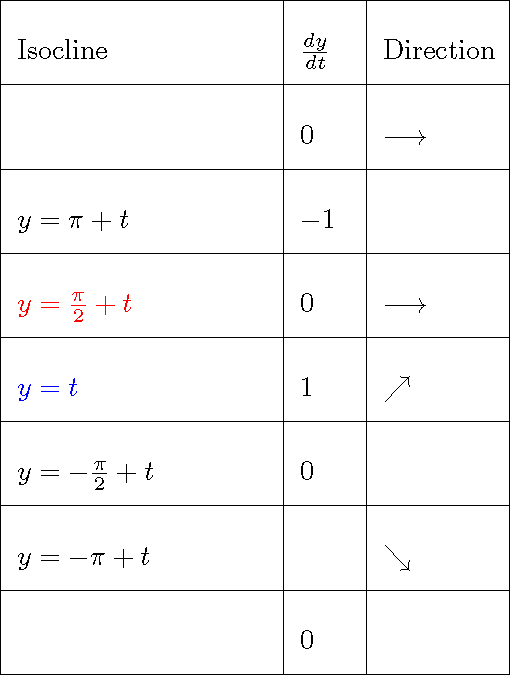

```{r setup, include=FALSE}
knitr::opts_chunk$set(echo = TRUE)
source(file.path("../../R/functions-mth321.R"))
```

**Name:**

**Collaborators:**

\noindent\rule{\textwidth}{1pt}
**Instructions:** Worksheets are graded mostly on completion and partially on correctness. Please write complete solutions showing explanations and key steps to the following problems, unless it says otherwise.
\noindent\rule{\textwidth}{1pt}

## Visualize Solutions of 1st-Order ODEs

### 1. Phase Diagram

*Phase diagrams* for 1st-order autonomous ODEs depict how the system evolves over time based solely on its current state, which does not require solving for the exact solution. It uses slope markers along the axis to show direction. 

Consider the *autonomous* 1st-order ODE, $\displaystyle \frac{dy}{dt} = \cos{(y)}$.

\begin{minipage}[t][\textheight-\pagetotal]{0.49\textwidth}
\begin{itemize}
  \item[a.] Define $f(y)$. Then, use the existence theorem to explain why the solution exists everywhere.
  \vfill
  \item[c.] Use the blank grid below to draw the phase diagram of the given ODE. Show the $f(y)$ curve, at least three equilibrium points, and the slope markers.
  \vspace{5px}
```{r echo=FALSE, fig.align='center', message=FALSE, warning=FALSE, out.width="90%", fig.width=4, fig.height=3}
# Create an empty data frame
empty_df <- data.frame(x = numeric(0), y = numeric(0))

# Generate the empty plot with grid lines
ggplot(empty_df, aes(x = x, y = y)) +
  geom_blank() +
  geom_vline(xintercept=0, color="black") +
  geom_hline(yintercept=0, color="black") +
  xlim(0,13) +
  xlab("y") +
  ylim(-1,1) +
  ylab("f") +
  theme_minimal()
```
\end{itemize}
\end{minipage}
\hfill\vline\hfill
\begin{minipage}[t][\textheight-\pagetotal]{0.49\textwidth}
\begin{itemize}
  \item[b.] Determine at least three equilibrium solutions, $y(t) = y^* \ge 0$.
  \vfill
  \item[d.] Use the phase diagram to describe how the specific solution would behave —including where it approaches— for the following initial conditions:
    \vspace{5px}
    \begin{enumerate}
      \item[i.] $y(0) = 0$
      \item[ii.] $y(0) = \pi$
      \item[iii.] $y(0) = \frac{\pi}{2}$
    \end{enumerate}
    \vfill
\end{itemize}
\end{minipage}

\newpage

### 2. Slope Field

*Slope fields* are graphical tools for visualizing the behavior of solutions of 1st-order differential equations without solving for the exact solution. They show discrete slope segments (vectors) at grid points, approximating the direction of solutions, which are themselves smooth and continuous curves.

Consider the *non-autonomous* 1st-order ODE, $\displaystyle \frac{dy}{dt} = \cos{(y - t)}$.

\begin{minipage}[t][0.40\textheight]{0.49\textwidth}
\begin{itemize}
  \item[a.] Write the function for the isoclines with the slopes $\frac{dy}{dt} = 1$, $\frac{dy}{dt} = -1$ and $\frac{dy}{dt} = 0$ (nullclines).
  \vfill
\end{itemize}
\end{minipage}
\hfill\vline\hfill
\begin{minipage}[t][0.40\textheight]{0.49\textwidth}
\begin{itemize}
  \item[b.] Use the uniqueness theorem to show that the specific solutions are unique, meaning the curves don't touch nor cross each other on the slope field.
  \vfill
\end{itemize}
\end{minipage}

c. Fill in the blanks of the table and use it as a guide to complete the slope field shown below. Then, draw at least four qualitatively different solution curves starting at $t=0$. Note that the solutions are unique as shown in Part (b).

\begin{minipage}[htbp!][\textheight-\pagetotal]{0.49\textwidth}
```{r table-isoclines, echo=FALSE, out.width = '100%', fig.align='center'}

```
\end{minipage}
\hfill\vline\hfill
\begin{minipage}[htbp!][\textheight-\pagetotal]{0.49\textwidth}
```{r echo=FALSE, fig.align='center', message=FALSE, warning=FALSE, out.width="100%", fig.width=3.5,fig.height=3.5}
# Create an empty data frame
empty_df <- data.frame(x = numeric(0), y = numeric(0))

# Generate the empty plot with grid lines
res = 15
p <- ggplot(empty_df, aes(x = x, y = y)) +
  geom_blank() +
  xlim(-0.25,2*pi+0.5) +
  xlab("t") +
  ylim(-0.25,2*pi+0.5) +
  ylab("y") +
  theme_classic()
for (i in seq(0,2*pi+0.5,length.out=res)) {
    p <- p + geom_vline(xintercept=i, color="#DBDBDB")
}
for (i in seq(0,2*pi+0.5,length.out=res)) {
    p <- p + geom_hline(yintercept=i, color="#DBDBDB")
}
p <- p + 
  geom_abline(intercept=pi/2, slope=1, color="red") +
  geom_abline(intercept=0, slope=1, color="blue")
x_vec = seq(0,6,length.out=8)
df_0 <- data.frame(x = x_vec, y = pi/2 + x_vec)
df_1 <- data.frame(x = x_vec, y = x_vec)
p <- p + 
  geom_segment(data = df_0, aes(x=x-0.25, y=y, xend=x+0.25, yend=y), arrow = arrow(length = unit(0.10, "inches"))) +
  geom_segment(data = df_1, aes(x=x-0.25, y=y-0.25, xend=x+0.25, yend=y+0.25), arrow = arrow(length = unit(0.10, "inches"))) 
p
```
\end{minipage}

<!-- \newpage

## **References**

::: {#refs}
:::

<br> -->
