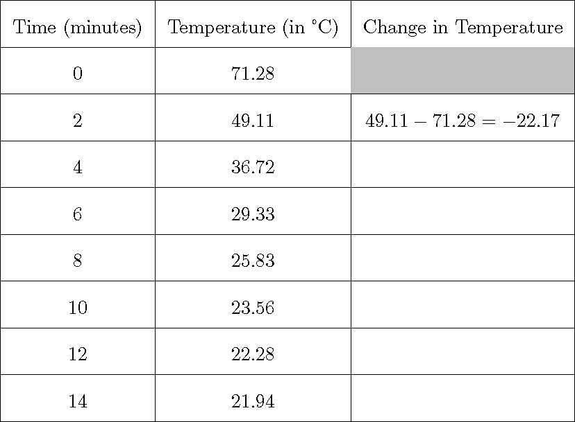

```{r setup, include=FALSE}
knitr::opts_chunk$set(echo = TRUE)
source(file.path("../../R/functions-mth321.R"))
```

**Name:**

**Collaborators:**

\noindent\rule{\textwidth}{1pt}
**Instructions:** Worksheets are graded mostly on completion and partially on correctness. Please write complete solutions showing explanations and key steps to the following problems, unless it says otherwise.
\noindent\rule{\textwidth}{1pt}

## Modeling Temperature

### 1. Temperature Change

A group of engineering students want to model how hot coffee cools over time. They plan to use a temperature probe to record the coffee's temperature at different times and then use the data to develop a rate-of-change equation that predicts the cooling process for other cups of coffee.

\begin{minipage}[t][\textheight-\pagetotal]{0.49\textwidth}
\begin{itemize}
  \item[a.] The data they collected is shown in the incomplete table below. The temperature (in Celsius) was recorded every 2 minutes over a 14 minute period. Complete the table.
```{r table-cooling-coffee, echo=FALSE, out.width = '100%', fig.align='center'}

```
  \item[b.] Using the table in Part (a), describe your observations of the temperature over time. How is the temperature changing and how is the change in temperature changing?
  \vfill
\end{itemize}
\end{minipage}
\hfill\vline\hfill
\begin{minipage}[t][\textheight-\pagetotal]{0.49\textwidth}
\begin{itemize}
  \item[c.] Use the blank axis shown below to plot the points in Part (a) where the current temperature is the $x$-axis and the change in temperature is the $y$-axis.
```{r echo=FALSE, fig.align='center', message=FALSE, warning=FALSE, out.width="100%", fig.width=4,fig.height=2.5}
ode_cooling <- function(t,y,parameters){
  with(as.list(c(parameters)),{
    dy <- -k*(y-y_temp)
    return(list(dy))
  })
}

y_vec <- seq(0,50,length.out=30)
dydt_vec <- ode_cooling(0,y_vec,c(k=0.7892,y_temp=20.89432))
ode_logistic_df <- data.frame(x = y_vec, y = dydt_vec[[1]])

ggplot(ode_logistic_df, aes(x = x, y = y)) +
  geom_blank() +
  geom_vline(xintercept=0, color="black") +
  geom_hline(yintercept=0, color="black") +
  ylim(-25,5) +
  xlab(latex2exp::TeX("temperature")) +
  ylab(latex2exp::TeX("change in temperature")) +
  theme_minimal()
```
  \item[d.] Describe what kind of plot is shown in Part (c). Is it a phase diagram or a slope field? Explain your reasoning.
  \vfill
  \item[e.] In Part (c), draw a line over the points approximating the trend. Then, use the first and last points to estimate the slope of this line and the equilibrium temperature. Interpret this values in context of the cooling coffee.
  \vfill
\end{itemize}
\end{minipage}

\newpage

### 2. Newton's Law of Cooling

Newton's law of cooling is modeled by a 1st-order ODE: $$T' = -k\left(T - T_{env}\right)$$ where $T$ is the object's temperature at time $t$, $T_{env}$ is the constant ambient temperature, and $k > 0$ is the cooling (or heat transfer) constant, which measures how quickly the object exchanges heat with its environment. The equation states that the rate of change of temperature is proportional to the difference between the object's temperature and the surrounding environment.

\begin{minipage}[t][\textheight-\pagetotal]{0.49\textwidth}
\begin{itemize}
  \item[a.] Continued from Problem (1), do you think the Newton's Law of Cooling is an appropriate model to describe the cooling rate for the hot coffee?
  \vfill
  \item[b.] Given the ODE, describe the meaning of each term in context of the cooling coffee.
  \vfill
  \item[c.] Suppose that a new hot coffee was made with the same initial temperature and cooling constant as the previous coffee, but it was placed in an environment with $T_{env} = 30$. Will it cool faster or slower than the previous coffee?
  \vfill
\end{itemize}
\end{minipage}
\hfill\vline\hfill
\begin{minipage}[t][\textheight-\pagetotal]{0.49\textwidth}
\begin{itemize}
  \item[d.] The general solution to the given ODE is $$T(t) = C e^{-kt} + T_{env},$$ where $C$ is an arbitrary constant. Given the initial temperature $T(0) = 71.28$, determine the specific solution.
  \vfill
  \item[e.] In 14 minutes, the temperature is $T(14) = 21.94$ Celsius. Use your equilibrium estimate from Problem (1e) as $T_{env}$ and estimate the value of $k$. Is this $k$ value close to your slope estimate in Problem (1e)?
  \vfill
\end{itemize}
\end{minipage}
\vfill

<!-- \newpage

## **References**

::: {#refs}
:::

<br> -->
