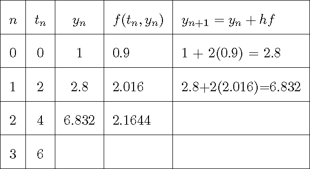
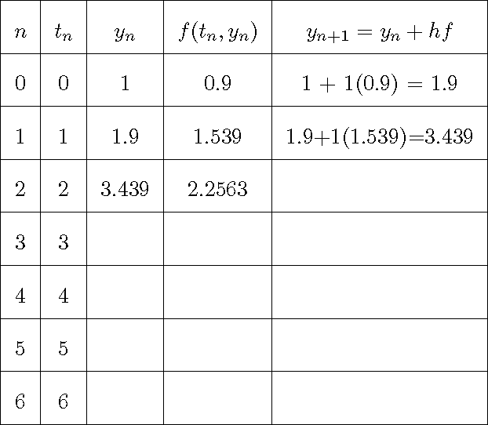
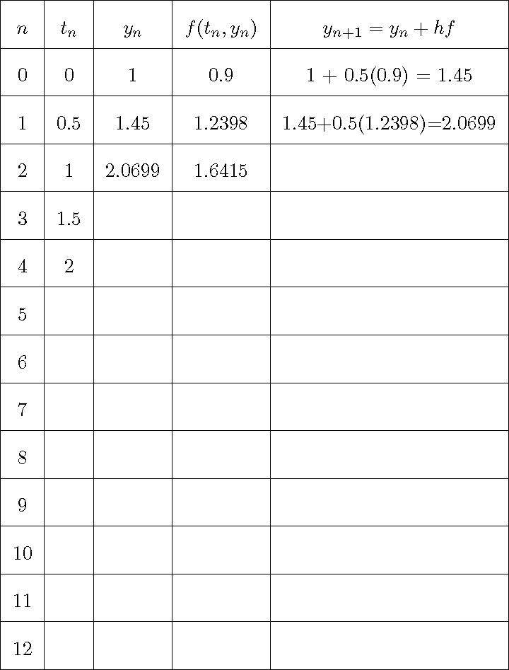

```{r setup, include=FALSE}
knitr::opts_chunk$set(echo = TRUE)
source(file.path("../../R/functions-mth321.R"))
```

**Name:**

**Collaborators:**

\noindent\rule{\textwidth}{1pt}
**Instructions:** Worksheets are graded mostly on completion and partially on correctness. Please write complete solutions showing explanations and key steps to the following problems, unless it says otherwise.
\noindent\rule{\textwidth}{1pt}

## Solve an ODE Numerically

### 1. Euler's Method

*Euler's Method* is a numerical method for approximating the solution of a first-order initial value problem of the form: $$y' = f(t,y), \hspace{10px} y(t_0)=y_0.$$

Instead of solving this analytically (using calculus), we use small steps to estimate values of $y$.

If we choose a *step size* $h$, then starting from $(t_0,y_0)$, we compute: $$y_{n+1} = y_n + h f(t_n,y_n) \hspace{10px} \text{ and } t_{n+1} = t_n + h.$$ This builds a table of points $(t_0,y_0), (t_1,y_1), \cdots$ that approximates the solution curve.

Consider the autonomous ODE $\displaystyle y' = y\left(1-\frac{y}{10}\right)$ with initial condition $y(0) = 1$.

\begin{minipage}[t][\textheight-\pagetotal]{0.49\textwidth}
  \begin{itemize}
    \item[a.] Let $\displaystyle f(t_n,y_n)=y_n\left(1-\frac{y_n}{10}\right)$. The table below shows a partially worked example using Euler's method to approximate the solution of the ODE using $h=2$. Complete the table. \\
```{r echo=FALSE, out.width = '100%', fig.align='center'}

```
  \end{itemize}
\end{minipage}
\hfill\vline\hfill
\begin{minipage}[t][\textheight-\pagetotal]{0.49\textwidth}
  \begin{itemize}
    \item[b.] Use the blank axis shown below to plot the points $(t_n,y_n)$ and connect them. \\
```{r echo=FALSE, fig.align='center', message=FALSE, warning=FALSE, out.width="100%", fig.width=3.5,fig.height=3}
ggplot() +
  scale_x_continuous(breaks = 0:6, limits = c(0, 6)) +
  scale_y_continuous(breaks = 0:12, limits = c(0, 12)) +
  xlab(latex2exp::TeX("t")) +
  ylab(latex2exp::TeX("y")) +
  theme_minimal()
```
  \end{itemize}
\end{minipage}

\newpage

### 2. Approximating Solutions

Continued from Problem (1). Let $\displaystyle f(t_n,y_n)=y_n\left(1-\frac{y_n}{10}\right)$.

\begin{minipage}[t][\textheight-\pagetotal]{0.49\textwidth}
  \begin{itemize}
    \item[a.] The table below shows a partially worked example using Euler's method to approximate the solution of the ODE using $h=1$. Complete the table. \\
```{r echo=FALSE, out.width = '100%', fig.align='center'}

```
    \vfill
    \item[b.] The table below shows a partially worked example using Euler's method to approximate the solution of the ODE using $h=0.5$. Complete the table.
```{r echo=FALSE, out.width = '100%', fig.align='center'}

```
    \vfill
  \end{itemize}
\end{minipage}
\hfill\vline\hfill
\begin{minipage}[t][\textheight-\pagetotal]{0.49\textwidth}
  \begin{itemize}
    \item[c.] On the slope field below, it shows a specific solution of the given ODE. Stitch together several segments to produce a graph of approximated solutions for each table completed in Parts (a-b) and Problem (1b), label each graph accordingly.
```{r echo=FALSE, fig.align='left', message=FALSE, warning=FALSE, out.width="100%", fig.width=3.5,fig.height=3}
ode <- function(t,y,parameters){
  with(as.list(c(parameters)),{
    dy <- y*(1-(y/10))
    return(list(dy))
  })
}
ode_solution = function(t){
  y <- (10*exp(t)/(9 + exp(t)))
  return(y)
}
t <- seq(0, 6, length.out = 100)
df_sol <- tibble(t=t,P=ode_solution(t))

SlopeField(ode,params=c(),
           tlim=c(0,6),ylim=c(-2,15),res=18,
           scale=0.50,radius=0.10,unit=FALSE,
           col="gray",xlab="t",ylab="y") +
  scale_x_continuous(breaks = 0:6, limits = c(0, 6)) +
  scale_y_continuous(breaks = 0:12, limits = c(0, 12)) +
  geom_line(data=df_sol,aes(x=t,y=P),color="blue",linewidth=1) +
  geom_text(aes(x=6,y=9),label="y(t)",color="blue")
```
    \item[d.] In Part (c), which graph is more accurate and why? What happens to the graph as the step size gets smaller and smaller?
    \vfill
  \end{itemize}
\end{minipage}

<!-- \newpage

## **References**

::: {#refs}
:::

<br> -->
